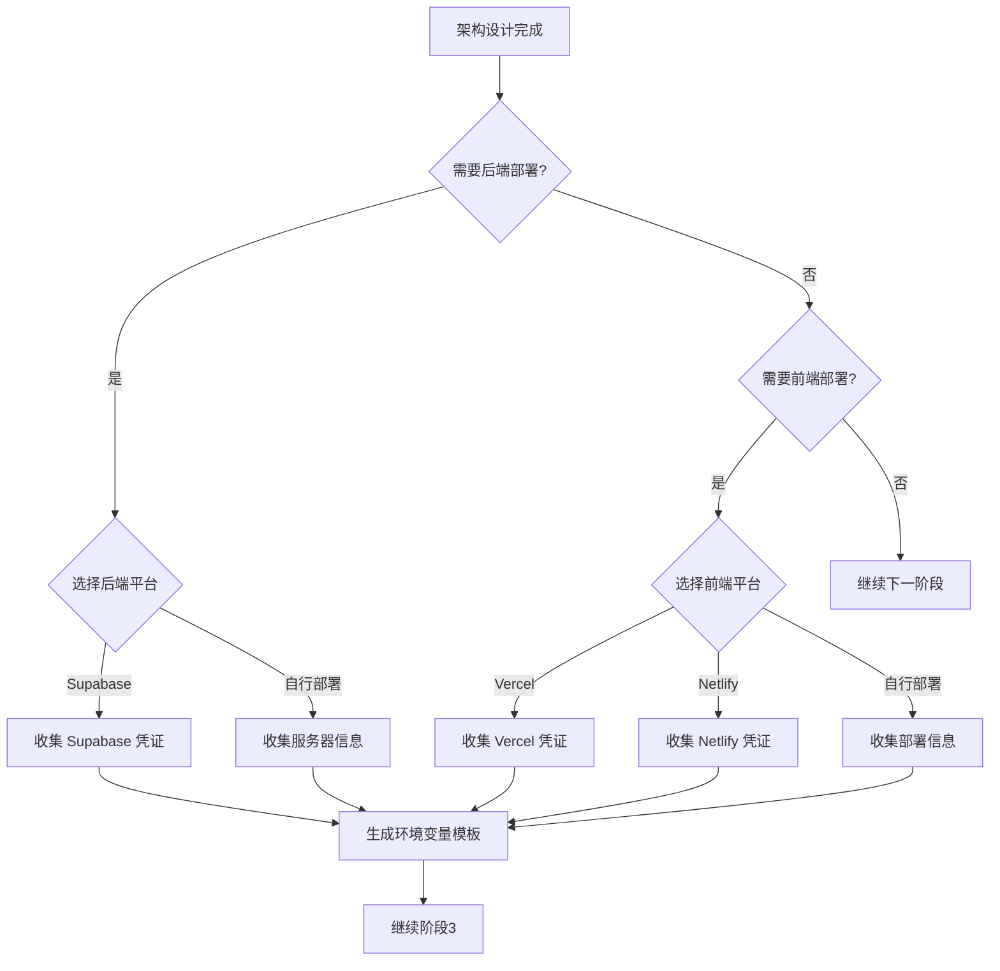

# 部署平台选项

> 本文档定义了 feature-development skill 支持的部署平台选项和询问流程。

## 部署询问时机

在 **阶段2（架构设计）** 完成后，询问用户部署需求：

```
架构设计已完成。关于部署，我有几个问题：

1. 是否需要部署后端服务？
2. 是否需要部署前端应用？
```

根据用户回答，继续询问具体平台选项。

---

## 后端部署选项

### 选项1: Supabase（推荐）

**适用场景**:
- 需要 PostgreSQL 数据库
- 需要身份认证（Auth）
- 需要实时订阅（Realtime）
- 需要 Storage（文件存储）
- 需要 Edge Functions

**优点**:
- 开箱即用的后端服务
- 免费层适合开发和小型项目
- 自带 Dashboard 管理界面
- 支持 Row Level Security（RLS）

**凭证信息**: 见 `credentials-checklist.md` 中的 Supabase 部分

### 选项2: 自行部署（VPS/云服务器）

**适用场景**:
- 需要完全控制服务器环境
- 有特殊依赖或配置需求
- 需要本地数据库或其他服务

**平台选项**:
- AWS EC2
- 阿里云 ECS
- 腾讯云 CVM
- DigitalOcean Droplet
- Vultr

**凭证信息**: 见 `credentials-checklist.md` 中的自行部署部分

### 选项3: 容器化部署（Docker/K8s）

**适用场景**:
- 微服务架构
- 需要高可用和自动扩缩容
- 团队有运维能力

**平台选项**:
- AWS ECS / EKS
- Google Cloud Run / GKE
- Azure Container Instances / AKS
- 阿里云 ACK

---

## 前端部署选项

### 选项1: Vercel（推荐 Next.js）

**适用场景**:
- Next.js 项目（首选）
- React 静态站点
- 需要自动 CI/CD
- 需要边缘函数（Edge Functions）

**优点**:
- 零配置部署
- 自动 HTTPS
- 全球 CDN
- 预览环境自动生成

**凭证信息**: 见 `credentials-checklist.md` 中的 Vercel 部分

### 选项2: Netlify

**适用场景**:
- 静态站点
- JAMstack 项目
- 需要 Netlify Functions

**优点**:
- 简单易用
- 表单处理
- Functions 支持

### 选项3: GitHub Pages

**适用场景**:
- 纯静态站点
- 文档站点
- 个人项目

### 选项4: 自行部署

**平台选项**:
- 云服务器 + Nginx
- Cloudflare Pages
- AWS CloudFront + S3

---

## 询问流程



---

## 域名和 DNS

无论选择哪种部署方式，都需要询问域名信息：

```
关于域名：
1. 是否有自定义域名？
2. DNS 是否已配置？
3. 是否需要配置 SSL 证书？
```

**DNS 配置参考**:
- A 记录：指向服务器 IP
- CNAME 记录：指向云平台域名
- MX 记录：邮件服务（如需要）
