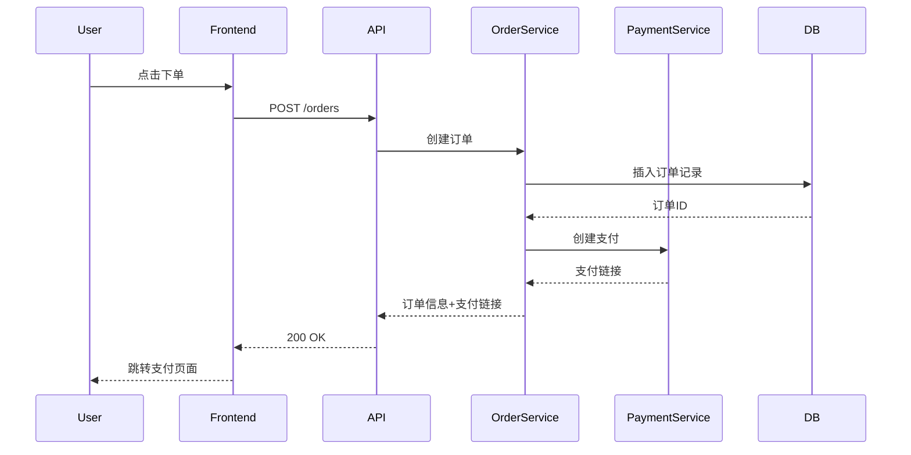

# 阶段2: 架构设计（Greenfield）

## 目标

基于 PRD，生成完整的技术方案，包括技术选型、系统架构、数据库设计、API 设计。

## 技术选型

### 前端技术栈

**关键决策**:
1. 框架选择：React / Vue / Angular / Next.js
2. 状态管理：Redux / Zustand / Recoil / Pinia
3. UI 组件库：Ant Design / Material-UI / Chakra UI
4. 构建工具：Vite / Webpack / Turbopack
5. 移动端：React Native / Flutter / 原生（如需要）

**决策依据**:
- 团队技术栈熟悉度
- 项目复杂度
- 性能要求
- 社区生态

**输出**: `doc/02_arch/1_技术选型.md`（前端部分）

### 后端技术栈

**关键决策**:
1. 语言选择：Python / Node.js / Java / Go / Rust
2. 框架选择：FastAPI / Express / Spring Boot / Gin
3. 数据库：PostgreSQL / MySQL / MongoDB / Redis
4. 缓存：Redis / Memcached
5. 消息队列：RabbitMQ / Kafka / Redis Streams
6. 搜索引擎：Elasticsearch / Meilisearch（如需要）

**决策依据**:
- 性能要求（QPS、并发量）
- 数据一致性要求（强一致 vs 最终一致）
- 团队技术栈熟悉度
- 社区生态和库支持

**输出**: `doc/02_arch/1_技术选型.md`（后端部分）

### 第三方服务

**常见服务**:
1. 认证授权：Auth0 / Firebase Auth / 自建 JWT
2. 支付：Stripe / PayPal / 支付宝 / 微信支付
3. 短信：Twilio / 阿里云短信 / 腾讯云短信
4. 邮件：SendGrid / Mailgun / AWS SES
5. 对象存储：AWS S3 / 阿里云 OSS / 七牛云
6. CDN：Cloudflare / AWS CloudFront / 阿里云 CDN
7. 监控：Datadog / New Relic / Prometheus + Grafana

**输出**: `doc/02_arch/1_技术选型.md`（第三方服务部分）

### 部署平台

**关键决策**:
1. 云平台：AWS / Azure / GCP / 阿里云 / 腾讯云
2. 容器化：Docker + Kubernetes / Docker Compose
3. CI/CD：GitHub Actions / GitLab CI / Jenkins
4. 域名和 DNS：Cloudflare / Route53 / 阿里云 DNS
5. SSL 证书：Let's Encrypt / Cloudflare SSL

**海内外部署考虑**:
- 国内：需要 ICP 备案，选择国内云平台（阿里云、腾讯云）
- 海外：选择国际云平台（AWS、GCP），考虑 GDPR 合规

**输出**: `doc/02_arch/1_技术选型.md`（部署平台部分）

## 系统架构

### 分层架构

**经典三层架构**:
```
[前端层] → [后端层] → [数据层]
```

**微服务架构**（如项目复杂）:
```
[前端层] → [API 网关] → [服务层] → [数据层]
                            ├─ 用户服务
                            ├─ 订单服务
                            ├─ 支付服务
                            └─ 通知服务
```

**DDD 架构**（如项目复杂且业务领域清晰）:
```
[前端] → [API 层] → [应用层] → [领域层] → [基础设施层]
                                  ├─ 聚合根
                                  ├─ 实体
                                  ├─ 值对象
                                  └─ 领域服务
```

**输出**: `doc/02_arch/2_系统架构.md`（包含 Mermaid 架构图）

### 模块划分

**示例**（电商平台）:
```
├── 用户模块
│   ├── 用户注册
│   ├── 用户登录
│   └── 用户信息管理
├── 商品模块
│   ├── 商品列表
│   ├── 商品详情
│   └── 商品搜索
├── 订单模块
│   ├── 购物车
│   ├── 下单
│   └── 订单管理
├── 支付模块
│   ├── 支付
│   └── 退款
└── 通知模块
    ├── 邮件通知
    └── 短信通知
```

**输出**: `doc/02_arch/2_系统架构.md`（模块划分部分）

## 交互时序图

### 核心场景时序图

**示例**（用户下单流程）:


**输出**: `doc/02_arch/3_交互时序图.md`（包含所有核心场景的 Mermaid 时序图）

## 数据库设计

### 数据表设计

**设计原则**:
1. 遵循数据库范式（通常 3NF）
2. 合理使用外键约束
3. 预留扩展字段（如 `extra_data` JSONB）
4. 统一命名规范（如下划线命名）
5. 统一时间字段（created_at, updated_at）

**表结构模板**:
```markdown
#### 表名：users

| 字段名 | 类型 | 属性 | 说明 |
|--------|------|------|------|
| id | BIGINT | PK, AUTO_INCREMENT | 用户ID |
| username | VARCHAR(50) | UNIQUE, NOT NULL | 用户名 |
| email | VARCHAR(100) | UNIQUE, NOT NULL | 邮箱 |
| password_hash | VARCHAR(255) | NOT NULL | 密码哈希 |
| created_at | TIMESTAMP | DEFAULT CURRENT_TIMESTAMP | 创建时间 |
| updated_at | TIMESTAMP | ON UPDATE CURRENT_TIMESTAMP | 更新时间 |
```

**输出**: `doc/03_database/1_数据表设计.md`

### 建表 SQL

**示例**:
```sql
-- 用户表
CREATE TABLE `users` (
  `id` BIGINT NOT NULL AUTO_INCREMENT,
  `username` VARCHAR(50) NOT NULL,
  `email` VARCHAR(100) NOT NULL,
  `password_hash` VARCHAR(255) NOT NULL,
  `created_at` TIMESTAMP DEFAULT CURRENT_TIMESTAMP,
  `updated_at` TIMESTAMP DEFAULT CURRENT_TIMESTAMP ON UPDATE CURRENT_TIMESTAMP,
  PRIMARY KEY (`id`),
  UNIQUE KEY `uk_username` (`username`),
  UNIQUE KEY `uk_email` (`email`)
) ENGINE=InnoDB DEFAULT CHARSET=utf8mb4 COMMENT='用户表';
```

**输出**: `doc/03_database/2_建表SQL.sql`

### 索引设计

**索引原则**:
1. 主键自动创建聚簇索引
2. 唯一字段创建唯一索引
3. 频繁查询字段创建普通索引
4. 联合查询创建组合索引
5. 避免过多索引（影响写入性能）

**示例**:
```sql
-- 订单表索引
CREATE INDEX `idx_user_id` ON `orders`(`user_id`);
CREATE INDEX `idx_status` ON `orders`(`status`);
CREATE INDEX `idx_created_at` ON `orders`(`created_at`);
CREATE INDEX `idx_user_status` ON `orders`(`user_id`, `status`);
```

**输出**: `doc/03_database/3_索引设计.sql`

### 数据字典

**枚举值说明**:
```markdown
#### 订单状态（order_status）

| 值 | 说明 |
|----|------|
| pending | 待支付 |
| paid | 已支付 |
| shipped | 已发货 |
| completed | 已完成 |
| cancelled | 已取消 |
```

**输出**: `doc/03_database/4_数据字典.md`

## API 设计

### RESTful API 规范

**命名规范**:
- 使用名词复数：`/users`, `/orders`
- 使用 HTTP 动词：GET（查询）、POST（创建）、PUT（更新）、DELETE（删除）
- 使用嵌套路由：`/users/{user_id}/orders`
- 使用查询参数：`/users?page=1&limit=20`

**接口模板**:
```markdown
#### POST /users/register

**描述**: 用户注册

**Request**:
- Content-Type: application/json
- Body:
  ```json
  {
    "username": "string",
    "email": "string",
    "password": "string"
  }
  ```

**Response**:
- 200 OK:
  ```json
  {
    "code": 0,
    "message": "注册成功",
    "data": {
      "user_id": 123,
      "username": "john",
      "email": "john@example.com"
    }
  }
  ```
- 400 Bad Request:
  ```json
  {
    "code": 40001,
    "message": "用户名已存在"
  }
  ```
```

**输出**: `doc/04_api/1_RESTful_API.md`

### OData 查询（可选）

如果需要复杂查询，可以使用 OData 规范：
```
GET /users?$filter=age gt 18&$orderby=created_at desc&$top=10
```

**输出**: `doc/04_api/2_OData查询.md`（如适用）

### 错误码定义

**错误码规范**:
- 0：成功
- 40001-49999：客户端错误
- 50001-59999：服务端错误

**示例**:
```markdown
| 错误码 | 说明 |
|--------|------|
| 0 | 成功 |
| 40001 | 参数错误 |
| 40002 | 用户名已存在 |
| 40003 | 邮箱已存在 |
| 40004 | 用户名或密码错误 |
| 50001 | 服务器内部错误 |
| 50002 | 数据库连接失败 |
```

**输出**: `doc/04_api/3_错误码定义.md`

## 文档审查

每个部分生成后，向用户展示并确认：
1. 技术选型是否合理？
2. 系统架构是否满足需求？
3. 数据库设计是否完整？
4. API 设计是否清晰？

## 完成标准

所有架构设计文档生成并通过用户审查后，阶段2 完成，进入阶段3。

## 输出清单

- ✅ `doc/02_arch/README.md`
- ✅ `doc/02_arch/1_技术选型.md`
- ✅ `doc/02_arch/2_系统架构.md`
- ✅ `doc/02_arch/3_交互时序图.md`
- ✅ `doc/03_database/README.md`
- ✅ `doc/03_database/1_数据表设计.md`
- ✅ `doc/03_database/2_建表SQL.sql`
- ✅ `doc/03_database/3_索引设计.sql`
- ✅ `doc/03_database/4_数据字典.md`
- ✅ `doc/04_api/README.md`
- ✅ `doc/04_api/1_RESTful_API.md`
- ✅ `doc/04_api/2_OData查询.md`（可选）
- ✅ `doc/04_api/3_错误码定义.md`
