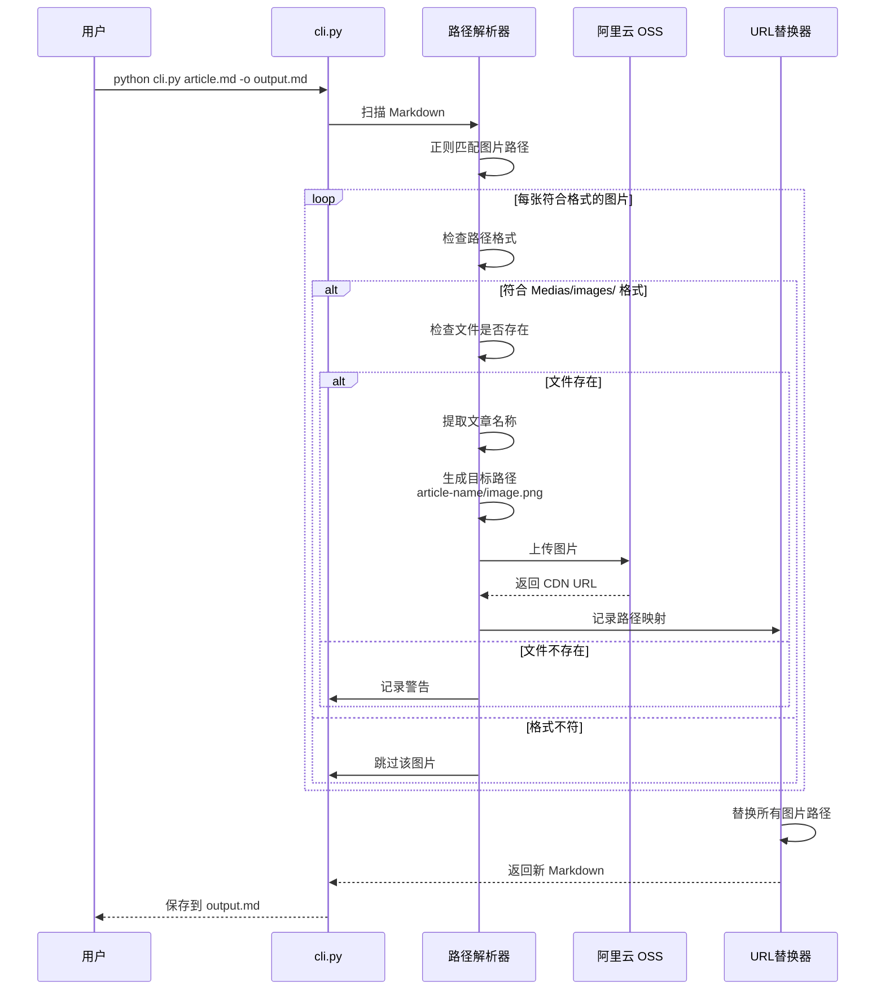
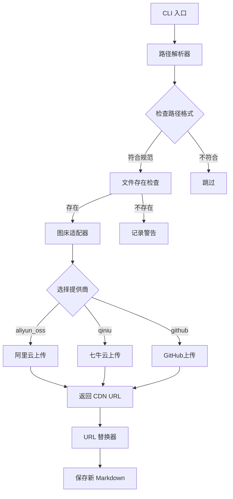

# Markdown 图床自动上传工具

一个专业的 Markdown 图片自动上传到图床的工具，支持阿里云 OSS 等多种图床服务，可独立使用或与其他 skill 集成。

## When to Use

使用此 skill 的场景：

- 📤 需要将 Markdown 文章中的本地图片上传到图床时
- 🔗 希望自动替换图片路径为 CDN URL 时
- 📁 需要按文章名称自动归类管理图片时
- 🔄 与 `/markdown-to-wechat` 或 `/content-creator` 配合使用时
- 🚀 需要批量处理多篇文章的图片上传时

## Features

### 核心功能

- ✅ **阿里云 OSS 上传**：支持阿里云对象存储（首个支持的图床）
- ✅ **智能路径解析**：自动识别 `Medias/images/` 路径的图片
- ✅ **自动路径替换**：上传后自动替换为 CDN URL
- ✅ **按文章归类**：自动按文章名创建目录（article-name/image.png）
- ✅ **路径格式检测**：只处理符合规范的图片路径
- ✅ **配置化管理**：通过 YAML 文件管理图床配置
- ✅ **可扩展架构**：预留接口支持未来扩展七牛云、GitHub 等图床

### 技术特点

- 基于阿里云 OSS Python SDK v2
- 支持相对路径和绝对路径解析
- 自动生成 URL 友好的文件路径
- 完善的错误处理和日志记录

## Instructions

### 步骤 1: 环境准备

#### 1.1 检查 Python 版本

确保 Python 版本 >= 3.8：

```bash
python --version
```

#### 1.2 安装依赖

进入 skill 目录并安装依赖：

```bash
cd ~/.cursor/skills/markdown-image-uploader
pip install -r requirements.txt
```

依赖包列表：
- `alibabacloud-oss-v2` >= 2.0.0 - 阿里云 OSS SDK v2
- `PyYAML` >= 6.0.1 - 配置文件解析
- `click` >= 8.1.7 - CLI 框架

### 步骤 2: 配置图床

#### 2.1 创建配置文件

```bash
# 复制配置模板
cd ~/.cursor/skills/markdown-image-uploader
cp config/image_hosts.yaml config/my_hosts.yaml
```

#### 2.2 填写阿里云 OSS 信息

编辑 `config/my_hosts.yaml`：

```yaml
# 当前启用的图床提供商
active_provider: aliyun_oss

# 阿里云 OSS 配置
aliyun_oss:
  access_key_id: "你的 AccessKey ID"        # ⭐ 必填
  access_key_secret: "你的 AccessKey Secret" # ⭐ 必填
  bucket: "你的 Bucket 名称"                # ⭐ 必填
  region: "oss-cn-hangzhou"                 # ⭐ 必填（根据你的区域）
  endpoint: "oss-cn-hangzhou.aliyuncs.com"  # ⭐ 必填
  use_ssl: true                             # 是否使用 HTTPS
  cdn_domain: ""                            # CDN 加速域名（可选）
  base_path: "markdown-images"              # 基础路径前缀
  
  # 路径组织策略
  path_strategy: article_name               # article_name | date_based | flat
  # - article_name: 按文章名称归类（推荐）
  # - date_based: 按日期归类（2026/01/25/xxx.png）
  # - flat: 平铺（所有图片在同一目录）
  
  # 文件名策略
  filename_strategy: keep_original          # keep_original | hash | uuid
  # - keep_original: 保持原文件名
  # - hash: 使用文件内容 hash
  # - uuid: 使用随机 UUID

# 七牛云配置（待扩展）
qiniu:
  enabled: false
  access_key: ""
  secret_key: ""
  bucket: ""
  domain: ""

# GitHub 图床配置（待扩展）
github:
  enabled: false
  repo: ""
  token: ""
  branch: main
  path: images
```

#### 2.3 获取阿里云 OSS 信息

**必需参数**：
1. **AccessKey ID**: 访问密钥 ID（格式如 `LTAI5t***********`）
2. **AccessKey Secret**: 访问密钥（格式如 `3Xj***********`）
3. **Bucket 名称**: 存储空间名称（如 `my-blog-images`）
4. **Region 地域**: 地域节点（如 `oss-cn-hangzhou` 华东1）

**可选参数**：
5. **CDN 域名**: 如果启用了 CDN 加速（如 `cdn.example.com`）
6. **基础路径**: 图片统一前缀（如 `markdown-images/`）

**获取方式**：
1. 登录 [阿里云控制台](https://oss.console.aliyun.com/)
2. **对象存储 OSS** → **Bucket 列表** → 选择或创建 Bucket
3. **AccessKey 管理** → 创建 AccessKey（或使用现有）
4. 记录所需信息填入配置文件

### 步骤 3: 基础使用

#### 3.1 独立使用（单独调用）

```bash
# 基础用法：上传并替换图片路径
cd ~/.cursor/skills/markdown-image-uploader
./venv/bin/python scripts/cli.py article.md -o article_with_cdn.md

# 指定文章名称（用于路径归类）
./venv/bin/python scripts/cli.py article.md -o output.md --article-name "claude-launcher-tutorial"

# 指定配置文件
./venv/bin/python scripts/cli.py article.md -o output.md --config config/my_hosts.yaml

# 模拟运行（不实际上传）
./venv/bin/python scripts/cli.py article.md --dry-run
```

#### 3.2 与 markdown-to-wechat 集成使用

```bash
# 在 markdown-to-wechat 中自动调用
cd ~/.cursor/skills/markdown-to-wechat
./convert.sh article.md --upload-images -o output.html

# 完整流程：上传图床 + 转换微信格式 + 预览
./convert.sh article.md --upload-images --theme deep-blue -o output.html -p
```

#### 3.3 与 content-creator 配合使用

```bash
# 1. 使用 content-creator 生成文章
@content-creator 帮我创建一篇关于AI编程的文章，发布到微信公众号

# 2. content-creator 会生成：Output/wechat/article.md（包含 Medias/images/ 或 images/ 路径）

# 3. 转换为微信格式（AI 会自动调用图床上传）
@markdown-to-wechat
```

**AI 自动执行流程**：
1. 检测工作区 → 找到 `Output/wechat/article.md`
2. 读取 Markdown → 发现本地图片
3. 调用 `markdown-image-uploader` 上传 → 获取 JSON 结果
4. 使用上传后的 Markdown 转换 HTML
5. 浏览器预览

**关键**：用户只需运行 `@markdown-to-wechat`，无需任何参数！

### 步骤 4: 工作流程详解

#### 4.1 图片路径要求

**标准格式**（由 content-creator 自动生成）：

```markdown


*▲ 在 Finder 工具栏中拖拽添加应用图标*
```

**要求**：
- ✅ 图片路径必须为 `Medias/images/文件名.ext`
- ✅ 必须有图片说明（``）
- ✅ 支持相对路径和绝对路径

**不符合格式的示例**（会被跳过）：
- ❌ `./images/cover.jpg`（路径不对）
- ❌ `../assets/pic.png`（路径不对）
- ❌ `https://example.com/img.png`（已是 URL）

#### 4.2 完整工作流程



#### 4.3 路径组织策略

**策略 1: 按文章名称归类（推荐）⭐**

```
OSS Bucket 结构:
markdown-images/
├── claude-launcher-tutorial/
│   ├── 01-preview.png
│   ├── 02-automator.png
│   └── 03-toolbar.png
├── python-asyncio-guide/
│   ├── event-loop.png
│   └── async-await.png
```

**优点**：
- ✅ 文件组织清晰，便于管理
- ✅ 方便单独删除某篇文章的图片
- ✅ 避免不同文章同名图片冲突

**文章名称提取规则**：
1. 优先从 `--article-name` 参数获取
2. 如果未指定，从 Markdown 的 H1 标题提取
3. 如果没有 H1，使用文件名（去除 `.md` 后缀）
4. 自动转换为 URL 友好格式（小写、连字符分隔）

**策略 2: 按日期归类**

```
OSS Bucket 结构:
markdown-images/
├── 2026/
│   └── 01/
│       └── 25/
│           ├── image-01.png
│           ├── image-02.png
```

**优点**：
- ✅ 符合时间线归档习惯
- ✅ 便于清理旧内容

**缺点**：
- ❌ 文件关联性弱
- ❌ 同一篇文章图片可能分散

**策略 3: 平铺模式**

```
OSS Bucket 结构:
markdown-images/
├── image-01-abc123.png
├── image-02-def456.png
```

**优点**：
- ✅ 结构简单

**缺点**：
- ❌ 文件太多时难以管理
- ❌ 必须使用 hash 避免冲突

### 步骤 5: 高级配置

#### 5.1 文件名冲突处理

```yaml
aliyun_oss:
  # ... 其他配置 ...
  
  # 文件名冲突处理策略
  conflict_strategy: skip  # skip | overwrite | rename
  # - skip: 跳过上传，使用已有 URL
  # - overwrite: 覆盖旧文件
  # - rename: 添加时间戳后缀（image_20260125143025.png）
```

#### 5.2 文件名策略

```yaml
aliyun_oss:
  # 保持原文件名（推荐）
  filename_strategy: keep_original
  
  # 或使用文件内容 hash（避免重复上传）
  filename_strategy: hash
  
  # 或使用随机 UUID（彻底避免冲突）
  filename_strategy: uuid
```

#### 5.3 CDN 加速配置

```yaml
aliyun_oss:
  cdn_domain: "cdn.example.com"  # 你的 CDN 域名
  
  # 生成的 URL 格式：
  # https://cdn.example.com/markdown-images/article-name/image.png
  
  # 如果不配置 CDN，使用 OSS 原始域名：
  # https://your-bucket.oss-cn-hangzhou.aliyuncs.com/markdown-images/...
```

### 步骤 6: 测试和验证

#### 6.1 测试单张图片上传

```bash
# 测试上传单张图片
python scripts/cli.py --test-upload ./test-image.png

# 预期输出：
# ✅ 图片上传成功！
# 📤 本地路径：./test-image.png
# 🔗 CDN URL：https://your-bucket.oss-cn-hangzhou.aliyuncs.com/...
```

#### 6.2 模拟运行（不实际上传）

```bash
# 模拟运行，查看将要执行的操作
python scripts/cli.py article.md --dry-run

# 预期输出：
# 🔍 扫描完成，发现 5 张图片
# 📤 将上传：
#   - Medias/images/01.png → article-name/01.png
#   - Medias/images/02.png → article-name/02.png
#   ...
# ⚠️ 模拟运行，未实际上传
```

#### 6.3 使用示例文件测试

```bash
# 使用示例文件测试
python scripts/cli.py examples/sample_with_images.md -o test_output.md

# 检查输出文件
cat test_output.md | grep "https://"  # 查看是否已替换为 CDN URL
```

## Best Practices

### 1. 图片准备

✅ **推荐做法**：
- 图片命名清晰（如 `01-preview.png`、`02-toolbar.png`）
- 图片大小适中（单张 < 5MB）
- 使用常见格式（jpg、png、webp）
- 放置在 `Medias/images/` 目录

❌ **避免做法**：
- 不要使用中文文件名
- 不要使用空格或特殊字符
- 不要上传过大的图片（先压缩）
- 不要使用损坏的图片文件

### 2. 配置管理

✅ **推荐做法**：
- 将 `my_hosts.yaml` 加入 `.gitignore`（保护密钥）
- 定期检查 OSS 存储空间使用情况
- 为不同项目创建不同的 Bucket
- 启用 CDN 加速（提升访问速度）

❌ **避免做法**：
- 不要将 AccessKey 提交到 Git
- 不要使用同一个 Bucket 混合存储
- 不要忘记配置 Bucket 的公共读权限

### 3. 路径组织

✅ **推荐做法**：
- 使用 `article_name` 策略（便于管理）
- 为每篇文章指定明确的 `--article-name`
- 使用统一的 `base_path` 前缀
- 定期清理不再使用的图片

❌ **避免做法**：
- 不要频繁更换路径策略
- 不要使用过深的目录层级
- 不要在路径中使用特殊字符

### 4. 与其他 Skill 集成

✅ **推荐做法**：
- 与 `/content-creator` 配合：确保图片格式符合规范
- 与 `/markdown-to-wechat` 配合：使用 `--upload-images` 参数
- 在 CI/CD 中使用：配置环境变量存储 AccessKey

❌ **避免做法**：
- 不要重复上传同一图片（浪费存储和流量）
- 不要在上传后手动修改 Markdown 路径

## 常见问题

### Q1: 支持哪些图床？

**A**: 当前支持：
- ✅ 阿里云 OSS（v2.0.0 SDK）

**计划支持**（待扩展）：
- 🔜 七牛云
- 🔜 腾讯云 COS
- 🔜 GitHub 图床
- 🔜 自定义上传（用户提供 API）

### Q2: 图片路径为什么必须是 `Medias/images/`？

**A**: 这是统一规范的设计：
- ✅ 与 `/content-creator` skill 的输出格式保持一致
- ✅ 明确区分本地图片和网络图片
- ✅ 便于自动化处理和批量上传

如果你的图片在其他路径，可以：
1. 移动到 `Medias/images/` 目录
2. 修改 Markdown 中的路径引用

### Q3: 上传失败怎么办？

**A**: 检查以下内容：
1. 配置文件是否正确（`my_hosts.yaml`）
2. AccessKey 是否有效
3. Bucket 是否存在且有权限
4. Region 配置是否正确
5. 图片文件是否存在且未损坏

### Q4: 如何避免重复上传？

**A**: 两种方式：
1. 使用 `filename_strategy: hash`（基于文件内容）
2. 使用 `conflict_strategy: skip`（检查 OSS 是否已存在）

### Q5: 支持批量处理吗？

**A**: 支持！

```bash
# 批量处理整个目录
python scripts/cli.py --batch ./articles/ --output ./articles_processed/

# 配合 find 命令处理特定文件
find ./articles -name "*.md" -exec python scripts/cli.py {} -o {}.processed \;
```

### Q6: CDN 域名如何配置？

**A**: 步骤：
1. 在阿里云 OSS 控制台绑定自定义域名
2. 配置 CDN 加速（可选）
3. 在 `my_hosts.yaml` 中填写 `cdn_domain`

生成的 URL 格式：
- 无 CDN：`https://your-bucket.oss-cn-hangzhou.aliyuncs.com/...`
- 有 CDN：`https://cdn.example.com/...`

## 文件结构

```
markdown-image-uploader/
├── SKILL.md                          # 本文档
├── README.md                         # 项目说明
├── requirements.txt                  # Python 依赖
│
├── config/
│   ├── image_hosts.yaml              # 配置模板
│   └── my_hosts.yaml                 # 你的配置（需创建）
│
├── scripts/
│   ├── __init__.py
│   ├── cli.py                        # 命令行工具
│   ├── uploader.py                   # 主上传器
│   ├── path_resolver.py              # 路径解析
│   └── providers/                    # 图床提供商
│       ├── __init__.py
│       ├── base.py                   # 基类接口
│       ├── aliyun_oss.py             # 阿里云 OSS
│       ├── qiniu.py                  # 七牛云（待实现）
│       ├── github.py                 # GitHub（待实现）
│       └── custom.py                 # 自定义上传（待实现）
│
├── tests/
│   ├── test_uploader.py
│   └── fixtures/
│       ├── sample_with_images.md
│       └── images/
│
└── examples/
    ├── sample_with_images.md         # 示例文件
    └── sample_config.yaml            # 示例配置
```

## 技术架构



## 更新日志

### v1.0.0 (2026-01-25)

- ✨ 初始版本发布
- ✅ 支持阿里云 OSS 上传
- ✅ 智能路径解析（Medias/images/）
- ✅ 自动路径替换
- ✅ 按文章名称归类
- ✅ YAML 配置管理
- ✅ CLI 工具
- ✅ 与 markdown-to-wechat 集成
- ✅ 与 content-creator 配合

## 贡献与反馈

如有问题或建议，欢迎反馈：
- 提交 Issue
- 提出改进建议
- 贡献新的图床支持

## License

MIT License - 自由使用和修改

---

**提示**: 首次使用建议先配置阿里云 OSS，然后用示例文件测试，确认工作正常后再处理实际文章。

---

**Made with ❤️ by 超级峰 | Powered by Cursor AI**
