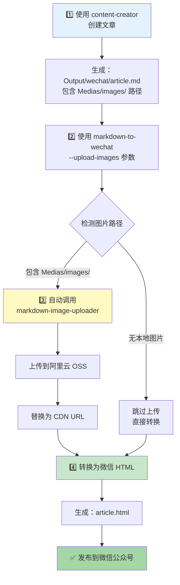
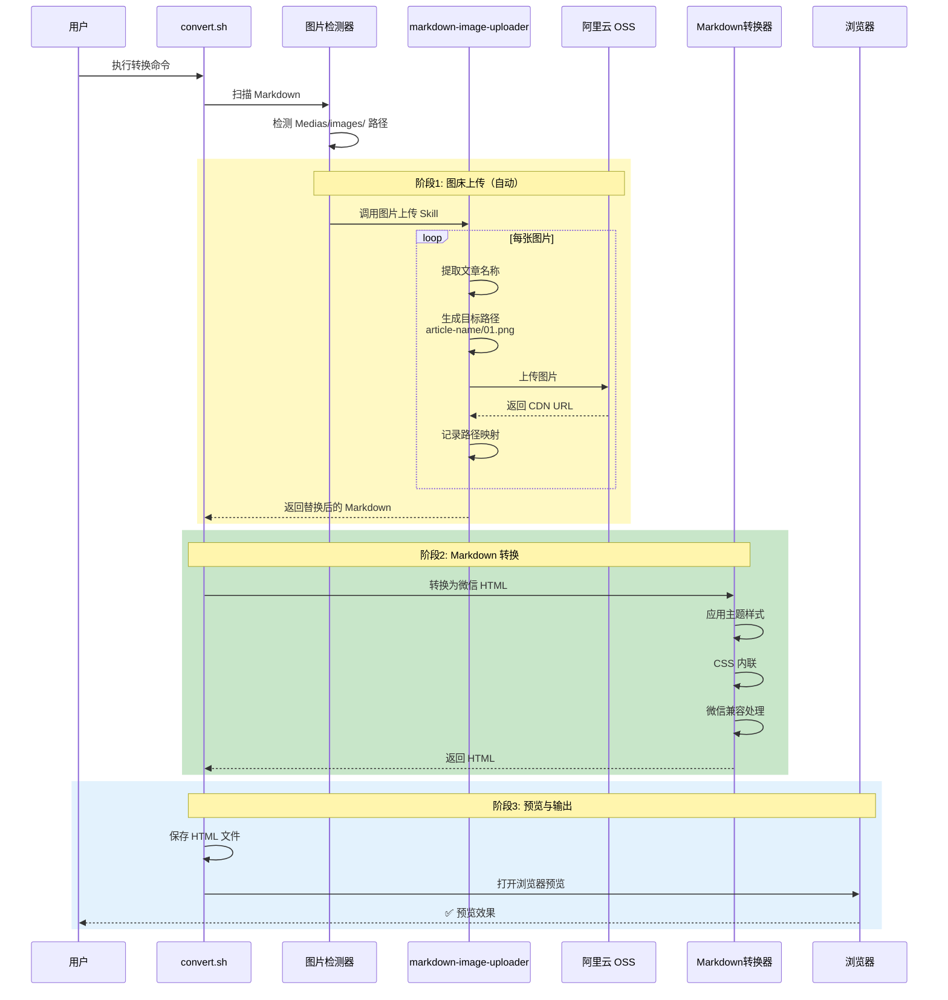

# 完整工作流程：从创作到发布

## 🎯 全流程概览



## 📋 详细步骤

### 步骤 1：使用 content-creator 创建文章

**命令**：
```bash
@content-creator 帮我创建一篇关于AI编程的文章，发布到微信公众号
```

**自动执行的流程**：
1. 阶段0：素材提取
2. 阶段1：选题策划（选择方案）
3. 阶段2：标题+大纲（选择标题）
4. 阶段3：写作剧本（确认）
5. 阶段4：生成初稿
6. 阶段5：评分+优化（如需）
7. 阶段6：多平台适配

**生成的文件**：
```
[工作区]/
├── Materials/
│   └── origin.md
├── Medias/
│   └── images/
│       ├── 01-preview.png
│       ├── 02-diagram.png
│       └── 03-result.png
└── Output/
    └── wechat/
        ├── article.md  ⭐ 关键文件
        ├── metadata.json
        └── images/
```

**关键点**：`Output/wechat/article.md` 中的图片格式为：

```markdown


*▲ 图注说明*
```

---

### 步骤 2：转换为微信格式（自动上传图床）

**命令**：
```bash
cd ~/.cursor/skills/markdown-to-wechat
./convert.sh /path/to/Output/wechat/article.md --upload-images --theme deep-blue -o article.html -p
```

**自动执行的流程**：



**生成的文件**：
```
article.html（图片已替换为 CDN URL）
```

---

### 步骤 3：发布到微信公众号

**方式1：使用剪贴板**

```bash
cd ~/.cursor/skills/markdown-to-wechat
python scripts/cli.py article.html -c
```

然后在微信公众号后台 `Cmd+V` 粘贴。

**方式2：使用浏览器**

1. 在浏览器中打开 `article.html`
2. `Cmd+A` 全选
3. `Cmd+C` 复制
4. 在微信公众号后台粘贴

---

## 🔍 关键环节详解

### 环节1：图片路径格式（由 content-creator 自动生成）

**标准格式**：
```markdown


*▲ 图注（可选）*
```

**为什么这样设计？**
- ✅ 统一规范，便于自动化处理
- ✅ 明确区分本地图片和网络图片
- ✅ 支持相对路径和绝对路径解析

### 环节2：图片上传策略（按文章名归类）

**OSS 存储结构**：
```
markdown-images/
└── ai-programming-tutorial/  ← 从 H1 标题或文件名提取
    ├── 01-preview.png
    ├── 02-diagram.png
    └── 03-result.png
```

**优点**：
- ✅ 文件组织清晰
- ✅ 方便单独删除某篇文章的图片
- ✅ 避免不同文章同名图片冲突

### 环节3：路径替换（自动）

**原始 Markdown**：
```markdown

```

**上传后自动替换为**：
```markdown

```

**微信 HTML 中**：
```html

<p style="..."><em>▲ 预览效果展示</em></p>
```

---

## 🚨 常见错误与解决

### 错误1：图片路径格式不对

**症状**：
```
⚠️ 警告：跳过不符合格式的图片路径
路径：./images/cover.jpg
```

**原因**：图片路径不是 `Medias/images/` 格式

**解决方案**：
1. 如果使用 `content-creator` 生成，会自动符合格式
2. 如果手动编写，修改路径为 `Medias/images/`

### 错误2：图床配置文件不存在

**症状**：
```
❌ 错误：图床配置文件不存在
路径：~/.cursor/skills/markdown-image-uploader/config/my_hosts.yaml
```

**原因**：未创建配置文件

**解决方案**：
```bash
cd ~/.cursor/skills/markdown-image-uploader
cp config/image_hosts.yaml config/my_hosts.yaml
# 编辑 my_hosts.yaml，填写阿里云 OSS 信息
```

### 错误3：上传失败

**症状**：
```
❌ 错误：上传图片失败 - Access Denied
```

**原因**：AccessKey 信息错误或无权限

**解决方案**：
1. 检查 `my_hosts.yaml` 中的配置
2. 登录阿里云控制台验证信息
3. 确保 Bucket 为公共读（或配置了 CDN）

---

## 📊 完整示例

### 输入：content-creator 生成的 Markdown

```markdown
# 保姆级教程：一键在Mac任意文件夹启动Claude Code

先给你看看最终效果。配置好之后，你在任意项目文件夹里...


*▲ 配置完成后的效果展示*

之前需要30秒甚至更久的操作，现在1秒搞定。

...
```

### 输出：微信公众号 HTML（图片已上传）

```html
<h1 style="...">保姆级教程：一键在Mac任意文件夹启动Claude Code</h1>

<p style="...">先给你看看最终效果。配置好之后，你在任意项目文件夹里...</p>

<p style="...">
  
</p>

<p style="font-size: 14px; color: #999; text-align: center;">
  <em>▲ 配置完成后的效果展示</em>
</p>

<p style="...">之前需要30秒甚至更久的操作，现在1秒搞定。</p>

...
```

---

## 🎉 优势总结

| 维度 | 优势 |
|------|------|
| **自动化程度** | ✅ 全流程自动，无需手动上传图片 |
| **文件管理** | ✅ 按文章归类，清晰有序 |
| **可维护性** | ✅ 单独管理每篇文章的图片 |
| **可扩展性** | ✅ 预留接口支持更多图床 |
| **解耦设计** | ✅ 三个 skill 独立，灵活组合 |
| **用户体验** | ✅ 一行命令完成所有操作 |

---

**下一步**：配置你的阿里云 OSS，开始体验全自动化的内容创作工作流！
