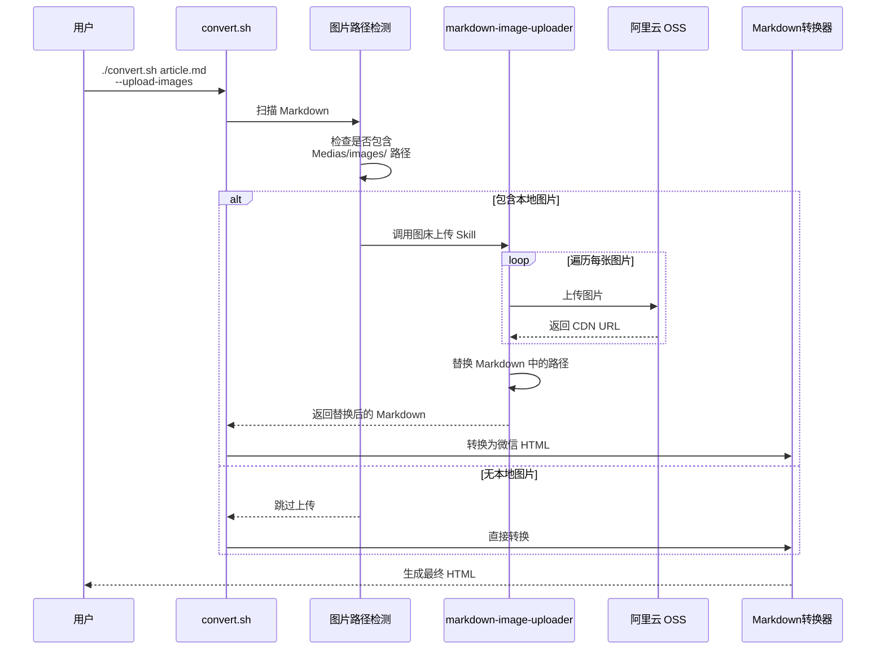
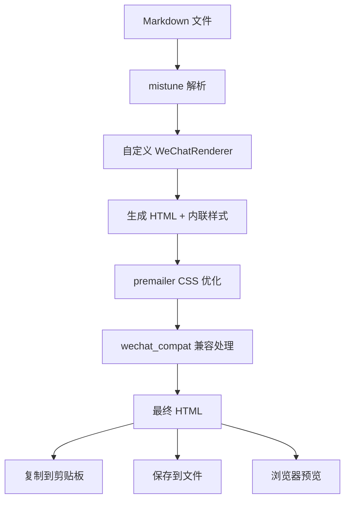

# Markdown 转微信公众号格式转换器

一个专业的 Markdown 到微信公众号格式转换工具，提供优雅的淡蓝色主题和完善的排版优化。

## ⚡ AI 立即执行指令（当 skill 被调用时）

**🚨 当用户调用此 skill 时，AI 必须立即执行以下操作，禁止询问用户：**

1. **立即执行步骤1（工作区检测）**，运行以下脚本：
   ```bash
   python ~/.cursor/skills/markdown-to-wechat/scripts/detect_workspace.py --json
   ```

2. **根据 JSON 输出的 `recommendation.action` 决策**：
   - `auto_select` → 自动使用 `target` 文件，继续步骤2
   - `ask_user` → 展示 `options`，询问用户选择，然后继续步骤2
   - `no_article` → 询问用户提供 Markdown 文件路径，然后继续步骤2

3. **不要在开始前询问用户"需要做什么"** ❌
4. **直接开始执行工作流** ✅

---

## AI Workflow（AI 执行指南）⭐

### 核心流程（3步，顺序执行）

```
1️⃣ 工作区检测 → 2️⃣ 图片上传（如有） → 3️⃣ Markdown转换
```

⚠️ **关键顺序**：必须先上传图床（步骤2），再转换 HTML（步骤3）

---

### 步骤 1：工作区检测（⚡ 自动执行）

**执行脚本**：
```bash
python ~/.cursor/skills/markdown-to-wechat/scripts/detect_workspace.py --json
```

**AI 根据 `recommendation.action` 决策**：
- `auto_select` → 自动使用 `target` 文件
- `ask_user` → 展示 `options`，询问用户
- `no_article` → 询问用户提供路径

---

### 步骤 2：图片上传检测（关键）⭐⭐⭐

**读取 Markdown 内容，检查本地图片**：

支持的图片路径格式（⚠️ 必须检测所有格式）：
- `images/` - 相对路径（最常见）
- `Output/wechat/images/` - 完整路径（微信平台）
- `Output/xhs/images/` - 完整路径（小红书平台）
- `Medias/images/` - 旧版格式（兼容）

```bash
# 检测本地图片（匹配多种路径格式）
grep -E '!\[.*?\]\((images/|Output/[^/]+/images/|Medias/images/).*?\)' "<markdown_file>"
```

**如果包含本地图片** → **必须执行上传**：

```bash
# 1. 告知用户
echo "🔍 检测到 X 张本地图片，正在上传到阿里云 OSS..."

# 2. 调用 uploader（使用虚拟环境）
cd ~/.cursor/skills/markdown-image-uploader
./venv/bin/python scripts/cli.py \
  "<markdown_file>" \
  -o "<temp_file>" \
  --article-name "<article_name>"

# 3. 解析 JSON 输出（在 ===...=== 之间）
# 4. 检查 status: "success" | "partial"
# 5. 使用 <temp_file> 继续步骤3
```

**JSON 输出示例**：
```json
{
  "status": "success",
  "total_images": 10,
  "uploaded": 10,
  "skipped": 0,
  "failed": 0,
  "output_file": "Output/wechat/article_with_cdn.md",
  "mappings": [
    {
      "local": "images/01.png",
      "cdn": "https://xxx.oss-cn-hangzhou.aliyuncs.com/.../01.png",
      "status": "uploaded"
    }
  ]
}
```

**如果无本地图片** → 跳过步骤2，直接步骤3

---

### 步骤 3：Markdown 转换

**使用正确的文件**：
- 如果步骤2执行了上传 → 使用 `output_file`（CDN URL）
- 如果步骤2跳过 → 使用原始文件

```bash
~/.cursor/skills/markdown-to-wechat/convert.sh \
  "<correct_markdown_file>" \
  --theme deep-blue \
  -o "<output_html>" \
  -p
```

---

## 关键决策表

| 场景 | 图片路径示例 | AI 应该做什么 |
|------|-------------|--------------|
| 检测到本地图片（相对路径） | `images/01.png` | ✅ 先调用 uploader → 等待完成 → 解析 JSON → 用新文件转换 |
| 检测到本地图片（完整路径） | `Output/wechat/images/01.png` | ✅ 先调用 uploader → 等待完成 → 解析 JSON → 用新文件转换 |
| 检测到本地图片（旧格式） | `Medias/images/01.png` | ✅ 先调用 uploader → 等待完成 → 解析 JSON → 用新文件转换 |
| 图片已是 CDN URL | `https://cdn.example.com/...` | ✅ 直接转换 HTML，跳过上传 |
| 无图片 | - | ✅ 直接转换 HTML |
| 上传失败 | - | ⚠️ 询问用户：跳过上传直接转换？还是中断？ |
| 配置缺失 | - | ❌ 提示配置步骤，中断流程 |

---

## When to Use

使用此 skill 的场景：

- 需要将 Markdown 文档发布到微信公众号时
- 希望统一文章排版风格和视觉效果时
- 需要自动处理代码高亮、链接转脚注等微信特殊需求时
- 想要快速生成符合微信公众号规范的 HTML 内容时
- 需要批量转换多篇文章到微信格式时
- 希望使用淡蓝色清新主题提升阅读体验时

## Features

### 核心功能

- ✅ **完整 Markdown 支持**：标题、段落、列表、表格、代码块、引用、图片等
- ✅ **多主题支持**：淡蓝色（清新）+ 深蓝色（专业）
- ✅ **淡橙色强调效果** ⭐ 新增
  - `**加粗**` → 淡橙色背景高亮，类似划线重点
  - `~~删除线~~` → 橙色虚线下划线，用于强调
- ✅ **代码语法高亮**：使用 Pygments 支持多种编程语言
- ✅ **链接自动转脚注**：外部链接自动转换为文末脚注
- ✅ **排版优化**：最佳行高（1.8）、字间距（0.5px）、段落间距
- ✅ **图片适配**：自动适配微信最大宽度（677px）
- ✅ **微信兼容**：CSS 完全内联、HTML 结构优化
- ✅ **一键复制**：支持复制到剪贴板，直接粘贴到微信后台
- ✅ **HTML 转长图** 🆕 新增
  - 一键将 HTML 转换为 PNG 长图
  - 基于 Playwright 实现完美渲染
  - 支持自定义图片宽度和质量

### 技术特点

- 基于 `mistune` 3.x 高性能 Markdown 解析器
- 使用 `premailer` 处理 CSS 内联
- 使用 `Pygments` 实现代码高亮
- 完全符合微信公众号 HTML/CSS 规范

## Instructions

### 步骤 1: 环境准备

#### 1.1 检查 Python 版本

确保 Python 版本 >= 3.8：

```bash
python --version
```

#### 1.2 安装依赖

进入 skill 目录并安装依赖：

```bash
cd ~/.cursor/skills/markdown-to-wechat
pip install -r requirements.txt
```

依赖包列表：
- `mistune` >= 3.0.2 - Markdown 解析器
- `premailer` >= 3.10.0 - CSS 内联工具
- `Pygments` >= 2.17.2 - 代码语法高亮
- `beautifulsoup4` >= 4.12.3 - HTML 处理
- `lxml` >= 5.1.0 - XML/HTML 解析
- `pyperclip` >= 1.8.2 - 剪贴板操作
- `PyYAML` >= 6.0.1 - 配置文件解析
- `click` >= 8.1.7 - CLI 框架

### 步骤 2: 基础使用

#### 2.1 使用便捷脚本（推荐）

我们提供了 `convert.sh` 脚本，会自动管理虚拟环境：

```bash
# 基础转换（默认使用淡蓝色主题）
./convert.sh your_article.md -o output.html

# 使用深蓝色主题（专业商务风格）⭐ 推荐
./convert.sh your_article.md --theme deep-blue -o output.html

# 转换并在浏览器预览
./convert.sh your_article.md --theme deep-blue -o output.html -p

# 查看主题信息
./convert.sh your_article.md --theme deep-blue --info

# 🆕 自动上传图片到图床（如果文章包含 Medias/images/ 路径）⭐ 重要
./convert.sh your_article.md --upload-images -o output.html

# 🆕 完整流程：上传图床 + 转换 + 预览
./convert.sh your_article.md --upload-images --theme deep-blue -o output.html -p

# 🆕 转换为 PNG 长图
./convert.sh your_article.md --to-image -o output.png

# 🆕 转换为长图并指定宽度
./convert.sh your_article.md --to-image --image-width 1200 -o output.png

# 🆕 转换为长图并在浏览器预览
./convert.sh your_article.md --to-image -p
```

**可用主题**：
- `light-blue`: 淡蓝色主题（清新风格，适合技术文章）
- `deep-blue`: 深蓝色主题（专业风格，适合商务内容）⭐ 推荐

查看完整主题指南：[THEMES.md](./THEMES.md)

**优势**：
- ✅ 自动检测并创建虚拟环境（仅首次）
- ✅ 自动检测并安装依赖（仅首次）
- ✅ 自动调用图床上传（如果需要）
- ✅ 之后使用直接复用，无需重复安装
- ✅ 无需手动激活虚拟环境

**图床上传说明**：
- 当 Markdown 中包含 `Medias/images/` 路径的图片时
- 添加 `--upload-images` 参数会自动：
  1. 调用 `/markdown-image-uploader` skill
  2. 将所有本地图片上传到阿里云 OSS
  3. 替换图片路径为 CDN URL
  4. 再执行 Markdown → HTML 转换
- 如果不添加该参数，则保持原路径不变

#### 2.2 直接使用 Python（高级用户）

如果你已经手动创建了虚拟环境，可以直接使用：

```bash
# 转换并保存到文件
./venv/bin/python scripts/cli.py your_article.md -o output.html

# 转换并在浏览器预览
./venv/bin/python scripts/cli.py your_article.md -o output.html -p

# 查看主题信息
./venv/bin/python scripts/cli.py your_article.md --info
```

#### 2.3 Python 脚本调用（编程集成）

如果需要在 Python 程序中集成：

```python
from scripts.converter import MarkdownToWeChatConverter

# 创建转换器
converter = MarkdownToWeChatConverter(theme_name='light-blue')

# 方式 1: 从文件转换
html = converter.convert_file('article.md', 'output.html')

# 方式 2: 从字符串转换
markdown_text = "# Hello World\n\nThis is a test."
html = converter.convert(markdown_text)

# 获取主题信息
theme_info = converter.get_theme_info()
print(theme_info)
```

### 步骤 3: HTML 转图片功能 🆕

#### 3.1 安装 Playwright（首次使用需要）

HTML 转图片功能基于 Playwright 实现，首次使用需要安装：

```bash
# 安装 Python 包
pip install playwright

# 安装浏览器引擎（约 300MB，仅需安装一次）
playwright install chromium
```

**注意**：
- 首次安装会下载 Chromium 浏览器引擎（~300MB）
- 下载速度取决于网络环境，国内用户可能需要配置代理
- 安装完成后，后续使用无需再次下载

#### 3.2 基础转换

```bash
# 最简单的用法：转换为 PNG 长图
./convert.sh article.md --to-image

# 指定输出文件名
./convert.sh article.md --to-image -o my_article.png

# 使用深蓝色主题生成图片
./convert.sh article.md --theme deep-blue --to-image -o output.png
```

#### 3.3 自定义图片宽度

```bash
# 生成 800px 宽的图片（默认）
./convert.sh article.md --to-image --image-width 800

# 生成 1200px 宽的图片（适合高清显示）
./convert.sh article.md --to-image --image-width 1200

# 生成 1920px 宽的图片（适合大屏展示）
./convert.sh article.md --to-image --image-width 1920
```

#### 3.4 预览和调试

```bash
# 转换并在浏览器中预览图片
./convert.sh article.md --to-image -p

# 转换并保留 HTML 文件（方便对比）
./convert.sh article.md --to-image -o article.png
# 此时会生成两个文件：article.png 和 article.html
```

#### 3.5 直接使用 Python 模块

如果需要在 Python 脚本中调用：

```python
from scripts.html2image import html_to_image

# 转换 HTML 文件为图片
success = html_to_image(
    html_path='input.html',
    output_path='output.png',
    viewport_width=1200,    # 视口宽度
    full_page=True,          # 截取全页面
    quality=100              # 图片质量（1-100）
)

if success:
    print("转换成功！")
```

#### 3.6 使用场景

**何时使用 HTML 转图片？**

1. **备份和归档**：将文章转换为图片永久保存
2. **多平台发布**：将图片发布到不支持 HTML 的平台（如小红书、Instagram）
3. **快速预览**：生成图片快速分享给他人预览
4. **打印输出**：将文章打印为图片格式
5. **解决兼容问题**：当微信公众号后台 HTML 渲染异常时，使用图片代替

**参数说明**：

| 参数 | 简写 | 默认值 | 说明 |
|------|------|--------|------|
| `--to-image` | `-i` | False | 启用 HTML 转图片功能 |
| `--image-width` | - | 800 | 图片宽度（像素） |
| `--output` | `-o` | - | 输出文件路径（.png 或 .html） |
| `--preview` | `-p` | False | 在浏览器中预览结果 |

### 步骤 4: 图床上传流程（与 markdown-image-uploader 集成）

#### 4.1 工作原理

当你使用 `--upload-images` 参数时，工作流如下：



#### 4.2 前置配置：配置阿里云 OSS（首次使用必须）

在使用图床上传功能前，需要先配置阿里云 OSS：

```bash
# 1. 进入 markdown-image-uploader skill 目录
cd ~/.cursor/skills/markdown-image-uploader

# 2. 复制配置模板
cp config/image_hosts.yaml config/my_hosts.yaml

# 3. 编辑配置文件，填写你的阿里云 OSS 信息
# （详细配置说明见下方）
```

**必需的阿里云 OSS 信息**：

```yaml
# config/my_hosts.yaml

active_provider: aliyun_oss

aliyun_oss:
  access_key_id: "你的 AccessKey ID"        # ⭐ 必填
  access_key_secret: "你的 AccessKey Secret" # ⭐ 必填
  bucket: "你的 Bucket 名称"                # ⭐ 必填
  region: "oss-cn-hangzhou"                 # ⭐ 必填（根据你的区域）
  endpoint: "oss-cn-hangzhou.aliyuncs.com"  # ⭐ 必填
  use_ssl: true
  cdn_domain: ""                            # 可选：如果启用了 CDN
  base_path: "markdown-images"              # 可选：统一前缀
  path_strategy: article_name                # 推荐：按文章名归类
  filename_strategy: keep_original           # 保持原文件名
```

**如何获取阿里云 OSS 信息？**

1. 登录 [阿里云控制台](https://oss.console.aliyun.com/)
2. 创建或选择一个 Bucket（存储空间）
3. 在 **AccessKey 管理** 中创建 AccessKey
4. 记录以下信息：
   - AccessKey ID
   - AccessKey Secret
   - Bucket 名称
   - Region（如 oss-cn-hangzhou）

#### 4.3 基础使用

```bash
# 方式1：自动检测并上传图片（推荐）
./convert.sh article.md --upload-images -o output.html

# 方式2：完整流程（上传 + 转换 + 预览）
./convert.sh article.md --upload-images --theme deep-blue -o output.html -p

# 方式3：与 content-creator 配合使用
# 假设你刚用 content-creator 生成了文章到 Output/wechat/article.md
./convert.sh Output/wechat/article.md --upload-images -o Output/wechat/article.html -p
```

#### 4.4 图片路径要求

**标准格式**（由 content-creator 自动生成）：

```markdown


*▲ 在 Finder 工具栏中拖拽添加应用图标*
```

**要求**：
- ✅ 图片路径必须为 `Medias/images/文件名.ext`
- ✅ 必须有图片说明（``）
- ✅ 图片下方可选添加小字说明（`*▲ ...*`）

**上传后自动替换为**：

```markdown


*▲ 在 Finder 工具栏中拖拽添加应用图标*
```

#### 4.5 路径组织策略

**推荐策略：按文章名称归类** ⭐

```
阿里云 OSS Bucket 结构:
markdown-images/
├── claude-launcher-tutorial/
│   ├── 01-preview.png
│   ├── 02-automator.png
│   └── 03-toolbar.png
├── python-asyncio-guide/
│   ├── event-loop.png
│   └── async-await.png
```

**优点**：
- ✅ 文件组织清晰，便于管理
- ✅ 方便单独删除某篇文章的图片
- ✅ 避免不同文章同名图片冲突

**文章名称提取规则**：
1. 优先从 Markdown 文件的 H1 标题提取
2. 如果没有 H1，使用文件名（去除 `.md` 后缀）
3. 自动转换为 URL 友好格式（小写、连字符分隔）

#### 4.6 故障排除

**问题1：提示"配置文件不存在"**

```
❌ 错误：图床配置文件不存在
路径：~/.cursor/skills/markdown-image-uploader/config/my_hosts.yaml

解决方案：
1. 按照步骤 4.2 创建配置文件
2. 填写你的阿里云 OSS 信息
```

**问题2：上传失败**

```
❌ 错误：上传图片失败 - Access Denied

可能原因：
1. AccessKey 信息错误
2. Bucket 不存在或无权限
3. Region 配置错误

解决方案：
1. 检查 my_hosts.yaml 中的配置
2. 登录阿里云控制台验证信息
3. 确保 Bucket 为公共读（或配置了 CDN）
```

**问题3：图片路径格式不对**

```
⚠️ 警告：跳过不符合格式的图片路径
路径：./images/cover.jpg

要求格式：Medias/images/文件名.ext

解决方案：
1. 如果使用 content-creator 生成，会自动符合格式
2. 如果手动编写，确保路径为 Medias/images/
```

### 步骤 5: 发布到微信公众号

#### 5.1 使用剪贴板（推荐）

```bash
python scripts/cli.py article.md -c
```

然后：
1. 打开微信公众号后台
2. 创建新图文消息
3. 在正文编辑器中按 `Cmd+V`（Mac）或 `Ctrl+V`（Windows）粘贴
4. 预览效果，满意后保存

#### 5.2 使用 HTML 文件

```bash
python scripts/cli.py article.md -o article.html -p
```

然后：
1. 在浏览器中查看效果
2. 按 `Cmd+A` / `Ctrl+A` 全选
3. 按 `Cmd+C` / `Ctrl+C` 复制
4. 在微信公众号后台粘贴

#### 5.3 使用长图（备选方案）

当 HTML 粘贴遇到问题时，可以使用图片：

```bash
# 生成长图
./convert.sh article.md --to-image -o article.png

# 在微信公众号后台上传图片
```

### 步骤 6: 自定义主题（高级）

#### 6.1 修改主题配置

编辑 `templates/light-blue/theme.yaml`：

```yaml
colors:
  primary: "#55C9EA"           # 修改主题色
  text_primary: "#3e3e3e"      # 修改正文颜色
  bg_code: "#e3f2fd"           # 修改代码背景色

typography:
  font_size_base: 15           # 修改正文字号
  line_height: 1.8             # 修改行高
  letter_spacing: 0.5          # 修改字间距
```

#### 6.2 创建自定义主题

1. 复制现有主题：
   ```bash
   cp -r templates/light-blue templates/my-theme
   ```

2. 修改 `templates/my-theme/theme.yaml`

3. 使用自定义主题：
   ```bash
   python scripts/cli.py article.md --theme my-theme
   ```

### 步骤 7: 测试示例

使用提供的示例文件测试：

```bash
# 转换示例文件
python scripts/cli.py examples/sample.md -o examples/sample_output.html -p

# 复制到剪贴板测试
python scripts/cli.py examples/sample.md -c
```

## 主题配置说明

### 淡蓝色主题特点

| 配置项 | 值 | 说明 |
|--------|-----|------|
| 主题色 | `#55C9EA` | 天空蓝，用于标题和强调 |
| 正文字号 | `15px` | 微信推荐的最佳阅读字号 |
| 行高 | `1.8` | 最舒适的阅读行高 |
| 字间距 | `0.5px` | 微调间距提升可读性 |
| 代码背景 | `#e3f2fd` | 淡蓝色代码背景 |
| 引用背景 | `#e1f5fe` | 浅蓝色引用背景 |

### 微信公众号规范

- 图片最大宽度：677px
- 禁用 JavaScript
- 禁用外部样式表
- 所有样式必须内联
- 外部链接建议转脚注
- 列表嵌套需要特殊处理

## 常见问题

### Q1: 如何处理图片？

**A**: 图片会自动适配微信宽度（677px），保持比例。建议：
- 使用微信图床或公共图床的图片链接
- 确保图片 URL 可公开访问
- 图片大小不超过 10MB

### Q2: 代码高亮不显示？

**A**: 确保：
1. 代码块指定了语言：\`\`\`python
2. Pygments 已正确安装
3. 主题配置中 `code_highlight.enabled` 为 true

### Q3: 链接无法点击？

**A**: 外部链接（http/https）会自动转换为脚注，内部链接（#anchor）保留。这是微信公众号的最佳实践。

### Q4: 复制到剪贴板失败？

**A**: 确保安装了 `pyperclip`：
```bash
pip install pyperclip
```

### Q5: 样式在微信中显示异常？

**A**: 可能原因：
- CSS 样式未完全内联（检查 premailer 是否正常工作）
- 使用了微信不支持的 CSS 属性
- HTML 结构不符合微信规范

解决方法：
1. 使用浏览器预览检查效果
2. 在微信公众号后台预览测试
3. 检查控制台是否有错误信息

### Q6: 如何批量转换？

**A**: 使用 bash 循环：
```bash
for file in *.md; do
    python scripts/cli.py "$file" -o "${file%.md}.html"
done
```

## 最佳实践

### 1. Markdown 编写建议

- **标题层级**：合理使用 H1-H3，避免过深嵌套
- **段落长度**：控制在 3-5 行，便于手机阅读
- **列表使用**：善用列表提升可读性
- **代码块**：明确指定语言以启用高亮
- **图片说明**：使用 alt 文本添加图片说明
- **链接管理**：重要链接放在文末，避免打断阅读

### 2. 排版建议

- **留白艺术**：适当的段落间距提升阅读体验
- **视觉层次**：通过标题、引用、代码块建立层次
- **色彩统一**：使用主题色突出重点
- **对齐方式**：正文两端对齐，代码左对齐

### 3. 微信公众号发布建议

- **预览测试**：发布前务必在手机上预览
- **图片检查**：确保所有图片都能正常加载
- **链接验证**：检查脚注链接是否完整
- **格式调整**：必要时在微信编辑器中微调

### 4. 性能优化

- **图片优化**：使用压缩后的图片
- **代码精简**：移除不必要的 HTML 注释
- **批量处理**：使用脚本批量转换文章

## 文件结构

```
markdown-to-wechat/
├── SKILL.md                          # 本文档
├── README.md                         # 项目说明
├── requirements.txt                  # Python 依赖
│
├── scripts/                          # 核心脚本
│   ├── __init__.py
│   ├── converter.py                  # 主转换器
│   ├── renderer.py                   # 自定义渲染器
│   ├── wechat_compat.py              # 微信兼容处理
│   └── cli.py                        # 命令行工具
│
├── templates/                        # 主题模板
│   └── light-blue/                   # 淡蓝色主题
│       └── theme.yaml                # 主题配置
│
├── config/                           # 配置文件
│   └── default_config.yaml           # 默认配置
│
├── examples/                         # 示例文件
│   ├── sample.md                     # 示例 Markdown
│   └── README.md                     # 示例说明
│
└── tests/                            # 测试文件
    ├── test_converter.py
    └── fixtures/
```

## 技术架构



## 更新日志

### v1.0.0 (2026-01-23)

- ✨ 初始版本发布
- ✅ 完整 Markdown 语法支持
- ✅ 淡蓝色主题
- ✅ 代码语法高亮
- ✅ 链接自动转脚注
- ✅ 微信兼容性处理
- ✅ CLI 工具
- ✅ 剪贴板支持

## 贡献与反馈

如有问题或建议，欢迎反馈：
- 提交 Issue
- 提出改进建议
- 分享使用经验

## License

MIT License - 自由使用和修改

---

**提示**: 首次使用建议先用示例文件测试，熟悉转换效果后再转换实际文章。
