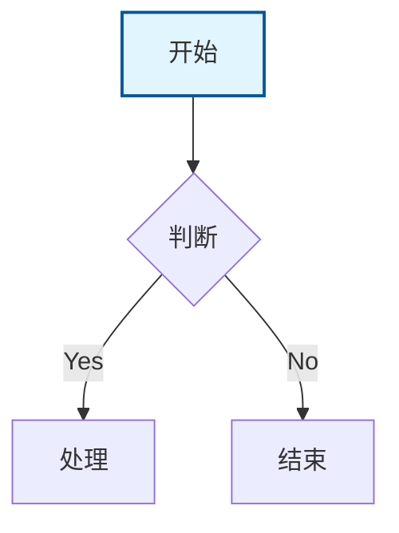
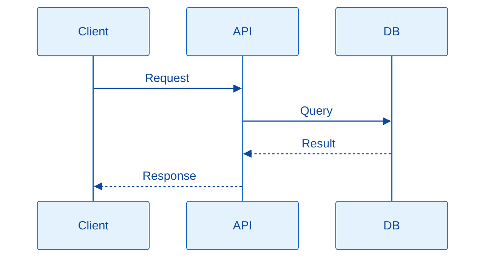
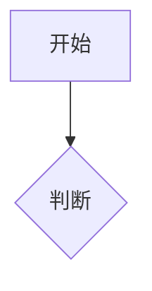

# [功能名称] 需求计划

## 一、功能概述 (Feature Overview)

### 1.1 用户故事 (User Story)
作为 <用户角色>，我想要 <执行动作/获得功能>，以便 <达成价值/解决痛点>。

### 1.2 核心价值
[列出该功能带来的核心业务价值或技术提升]

---

## 二、架构与流程设计 (Architecture & Flow)

### 2.1 业务流程图 (Mermaid Flowchart)


### 2.2 数据交互时序图 (Mermaid Sequence Diagram)


---

## 三、前端技术方案 (Frontend)
[仅当 scope 包含前端时可见]

### 3.1 界面布局 (UI Wireframe)
```
┌─────────────────────────────────┐
│             Header              │
├──────────┬──────────────────────┤
│ Sidebar │      Main Content     │
└──────────┴──────────────────────┘
```

### 3.2 数据模型 (Frontend Models)
模型文件：`[Path/To/Model.swift]`
```swift
struct [ModelName]: Codable, Identifiable {
    let id: Int
    let type: [Enum]
    var localizedTitle: String { ... }
    var displayColor: Color { ... }
}
```

### 3.3 组件定义 (Component Specs)
组件：`[组件名称]`
| 属性/事件 (Prop/Event) | 类型 (Type) | 说明 (Description) |
| --- | --- | --- |
| `isVisible` | Boolean | 控制弹窗显示 |
| `onConfirm` | Function | 点击确认后的回调 |

### 3.4 交互逻辑 (Interaction Flow)
场景1：**[场景名称]**
- 逻辑描述：[描述]


### 3.5 本地化 (Localization)
文件： `Resources/Localization/Localizable.xcstrings`
* `key.name`: "中文" / "English"

### 3.6 文件变动清单 (File Changes)
* **新增** `path/to/file.ext` - 文件说明
* **修改** `path/to/file.ext` - 修改说明

**依赖情况**：
* *NPM 包*: `package-name` (版本) - 用途
* *内部组件*: `@/components/xxx` - 复用说明
* *静态资源*: `path/to/asset` - 用途

---

## 四、后端技术方案 (Backend)
[仅当 scope 包含后端时可见]

### 4.1 数据库设计 (Database Schema)
表名：`table_name`
| 字段名 (Field) | 类型 | 属性 | 说明 |
| :--- | :--- | :--- | :--- |
| `id` | BIGINT | PK | 主键 |

### 4.2 接口设计 (API Interface)
接口：**[接口名称]**
* **Method**: `POST`
* **Path**: `/api/xxx`
* **Request Params**:
| 参数名 | 类型 | 必填 | 说明 |
| :--- | :--- | :--- | :--- |
| `param` | String | Yes | 参数说明 |

### 4.3 核心业务流程 (Core Logic)


### 4.4 文件变动清单 (File Changes)
* **新增** `backend/app/services/xxx.py` - 服务说明
* **修改** `backend/app/api/endpoints.py` - 修改说明

**依赖情况**：
* *外部库*: `package-name` (版本) - 用途
* *内部模块*: `path.to.module` - 复用说明
* *环境变量*: `KEY_NAME` - 配置说明

---

## 五、开发执行计划 (Action Plan)
1. [Step 1]
2. [Step 2]
3. [Step 3]

---

## 六、文档维护 (Documentation Updates)
* [ ] `Documentation/Basic/File-structure.md` 项目文件结构
* [ ] `Documentation/Basic/App-flow.md` 产品流程说明
* [ ] `Documentation/Basic/PRD.md` 产品逻辑说明（含用户故事）
* [ ] `Documentation/Basic/Frontend-guidelines.md` 前端开发规范说明
* [ ] `Documentation/Basic/Backend-structure.md` 后端架构设计说明
* [ ] `Documentation/Basic/Tech-stack.md` 项目技术栈说明
