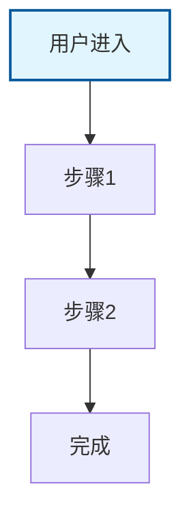

# [项目名称] 产品记忆 (Product Memory)

> 最后更新：YYYY-MM-DD
> 用途：为 AI 提供稳定的业务上下文

---

## 技术栈

<!-- 🟢 AI 自动检测：分析 package.json, Podfile, go.mod, *.csproj 等依赖文件 -->

| 类别 | 技术选型 |
|------|----------|
| 前端 | [AI 检测后填写] |
| 后端 | [AI 检测后填写] |
| 数据库 | [AI 检测后填写] |
| 平台 | [AI 检测后填写] |

---

## 产品定位

<!-- 🔴 需要询问用户：代码无法推断产品价值 -->

**一句话描述**：[需用户确认 - 这个产品为谁解决什么问题？]

---

## 用户画像

<!-- 🔴 需要询问用户：代码无法推断用户目标和痛点 -->

| 用户类型 | 目标 | 痛点 |
|---------|------|------|
| [用户类型 1] | [想要达成什么] | [遇到什么困难] |
| [用户类型 2] | [想要达成什么] | [遇到什么困难] |
| [用户类型 3] | [想要达成什么] | [遇到什么困难] |

---

## 核心功能

<!-- 🟢 AI 自动推断：通过路由、组件、API 端点分析 -->

1. **[功能名称]**：[简短描述]
2. **[功能名称]**：[简短描述]
3. **[功能名称]**：[简短描述]
4. **[功能名称]**：[简短描述]

---

## 核心流程

<!-- 🟢 AI 自动推断：通过调用图、入口点分析，生成 Mermaid 流程图 -->

---

## 更新记录

| 日期 | 变更内容 |
|------|----------|
| YYYY-MM-DD | 初始创建 |
