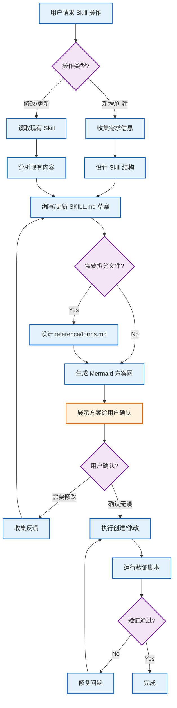
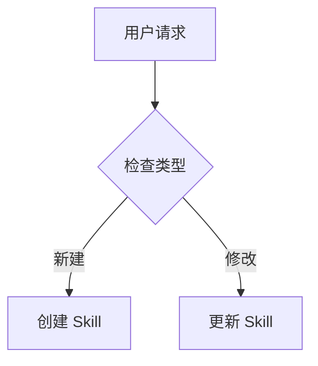
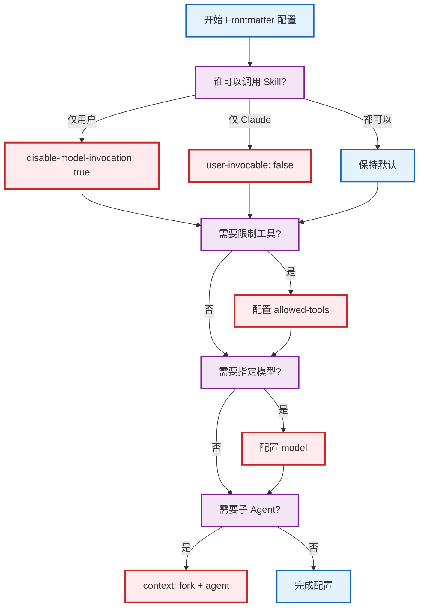

# Skill Creator

> **⚠️ MANDATORY WORKFLOW - READ FIRST**
> Before creating or modifying ANY Skill files, you MUST follow the **Pre-Creation Confirmation Flow** below. This is NOT optional - you must get explicit user confirmation before running `init_skill.py` or creating any files.

This skill provides guidance for creating effective skills.

## About Skills

Skills are modular, self-contained packages that extend Claude's capabilities by providing
specialized knowledge, workflows, and tools. Think of them as "onboarding guides" for specific
domains or tasks—they transform Claude from a general-purpose agent into a specialized agent
equipped with procedural knowledge that no model can fully possess.

### What Skills Provide

1. Specialized workflows - Multi-step procedures for specific domains
2. Tool integrations - Instructions for working with specific file formats or APIs
3. Domain expertise - Company-specific knowledge, schemas, business logic
4. Bundled resources - Scripts, examples, templates, and references for complex and repetitive tasks

## Core Principles

### Concise is Key

The context window is a public good. Skills share the context window with everything else Claude needs: system prompt, conversation history, other Skills' metadata, and the actual user request.

**Default assumption: Claude is already very smart.** Only add context Claude doesn't already have. Challenge each piece of information: "Does Claude really need this explanation?" and "Does this paragraph justify its token cost?"

Prefer concise examples over verbose explanations.

### Set Appropriate Degrees of Freedom

Match the level of specificity to the task's fragility and variability:

**High freedom (text-based instructions)**: Use when multiple approaches are valid, decisions depend on context, or heuristics guide the approach.

**Medium freedom (pseudocode or scripts with parameters)**: Use when a preferred pattern exists, some variation is acceptable, or configuration affects behavior.

**Low freedom (specific scripts, few parameters)**: Use when operations are fragile and error-prone, consistency is critical, or a specific sequence must be followed.

Think of Claude as exploring a path: a narrow bridge with cliffs needs specific guardrails (low freedom), while an open field allows many routes (high freedom).

### Anatomy of a Skill

Every skill consists of a required SKILL.md file and optional bundled resources:

```
skill-name/
├── SKILL.md           # Main instructions (required)
├── template.md        # Template for Claude to fill in (optional)
├── data/              # Runtime data - persists across sessions (optional)
│   └── memory.md      # Persistent memory for repeated-use skills
├── examples/
│   └── sample.md      # Example output showing expected format (optional)
├── reference.md       # Detailed reference docs (optional)
└── scripts/
    └── helper.py       # Utility script - executed, not loaded (optional)
```

**Official structure from** https://code.claude.com/docs/en/skills

#### SKILL.md (required)

Every SKILL.md consists of:

- **Frontmatter** (YAML): Contains `name` and `description` fields. These are the only fields that Claude reads to determine when the skill gets used, thus it is very important to be clear and comprehensive in describing what the skill is, and when it should be used.
- **Body** (Markdown): Instructions and guidance for using the skill. Only loaded AFTER the skill triggers (if at all).

#### Bundled Resources (optional)

##### Scripts (`scripts/`)

Executable code (Python/Bash/etc.) for tasks that require deterministic reliability or are repeatedly rewritten.

- **When to include**: When the same code is being rewritten repeatedly or deterministic reliability is needed
- **Example**: `scripts/rotate_pdf.py` for PDF rotation tasks
- **Benefits**: Token efficient, deterministic, may be executed without loading into context
- **Note**: Scripts may still need to be read by Claude for patching or environment-specific adjustments

##### References (`references/`)

Documentation and reference material intended to be loaded as needed into context to inform Claude's process and thinking.

- **When to include**: For documentation that Claude should reference while working
- **Examples**: `references/finance.md` for financial schemas, `references/mnda.md` for company NDA template, `references/policies.md` for company policies, `references/api_docs.md` for API specifications
- **Use cases**: Database schemas, API documentation, domain knowledge, company policies, detailed workflow guides
- **Benefits**: Keeps SKILL.md lean, loaded only when Claude determines it's needed
- **Best practice**: If files are large (>10k words), include grep search patterns in SKILL.md
- **Avoid duplication**: Information should live in either SKILL.md or references files, not both. Prefer references files for detailed information unless it's truly core to the skill—this keeps SKILL.md lean while making information discoverable without hogging the context window. Keep only essential procedural instructions and workflow guidance in SKILL.md; move detailed reference material, schemas, and examples to references files.

##### Examples (`examples/`)

Example outputs showing expected formats or patterns.

- **When to include**: When demonstrating expected output formats or usage patterns
- **Examples**: `examples/sample.md` for output format, `examples/basic-test.js` for test patterns
- **Use cases**: Sample outputs, format templates, usage examples
- **Benefits**: Shows Claude what expected output looks like without loading into context

##### Template (`template.md`)

Template file for Claude to fill in with generated content.

- **When to include**: When the skill generates structured output following a specific format
- **Examples**: Report templates, documentation templates, PR description templates
- **Use cases**: Any structured document generation
- **Benefits**: Provides consistent output structure

#### What to Not Include in a Skill

A skill should only contain essential files that directly support its functionality. Do NOT create extraneous documentation or auxiliary files, including:

- README.md
- INSTALLATION_GUIDE.md
- QUICK_REFERENCE.md
- CHANGELOG.md
- etc.

The skill should only contain the information needed for an AI agent to do the job at hand. It should not contain auxilary context about the process that went into creating it, setup and testing procedures, user-facing documentation, etc. Creating additional documentation files just adds clutter and confusion.

### Progressive Disclosure Design Principle

Skills use a three-level loading system to manage context efficiently:

1. **Metadata (name + description)** - Always in context (~100 words)
2. **SKILL.md body** - When skill triggers (<5k words)
3. **Bundled resources** - As needed by Claude (Unlimited because scripts can be executed without reading into context window)

#### Progressive Disclosure Patterns

Keep SKILL.md body to the essentials and under 500 lines to minimize context bloat. Split content into separate files when approaching this limit. When splitting out content into other files, it is very important to reference them from SKILL.md and describe clearly when to read them, to ensure the reader of the skill knows they exist and when to use them.

**Key principle:** When a skill supports multiple variations, frameworks, or options, keep only the core workflow and selection guidance in SKILL.md. Move variant-specific details (patterns, examples, configuration) into separate reference files.

**Pattern 1: High-level guide with references**

```markdown
# PDF Processing

## Quick start

Extract text with pdfplumber:
[code example]

## Advanced features

- **Form filling**: See [FORMS.md](FORMS.md) for complete guide
- **API reference**: See [REFERENCE.md](REFERENCE.md) for all methods
- **Examples**: See [EXAMPLES.md](EXAMPLES.md) for common patterns
```

Claude loads FORMS.md, REFERENCE.md, or EXAMPLES.md only when needed.

**Pattern 2: Domain-specific organization**

For Skills with multiple domains, organize content by domain to avoid loading irrelevant context:

```
bigquery-skill/
├── SKILL.md (overview and navigation)
└── reference/
    ├── finance.md (revenue, billing metrics)
    ├── sales.md (opportunities, pipeline)
    ├── product.md (API usage, features)
    └── marketing.md (campaigns, attribution)
```

When a user asks about sales metrics, Claude only reads sales.md.

Similarly, for skills supporting multiple frameworks or variants, organize by variant:

```
cloud-deploy/
├── SKILL.md (workflow + provider selection)
└── references/
    ├── aws.md (AWS deployment patterns)
    ├── gcp.md (GCP deployment patterns)
    └── azure.md (Azure deployment patterns)
```

When the user chooses AWS, Claude only reads aws.md.

**Pattern 3: Conditional details**

Show basic content, link to advanced content:

```markdown
# DOCX Processing

## Creating documents

Use docx-js for new documents. See [DOCX-JS.md](DOCX-JS.md).

## Editing documents

For simple edits, modify the XML directly.

**For tracked changes**: See [REDLINING.md](REDLINING.md)
**For OOXML details**: See [OOXML.md](OOXML.md)
```

Claude reads REDLINING.md or OOXML.md only when the user needs those features.

**Important guidelines:**

- **Avoid deeply nested references** - Keep references one level deep from SKILL.md. All reference files should link directly from SKILL.md.
- **Structure longer reference files** - For files longer than 100 lines, include a table of contents at the top so Claude can see the full scope when previewing.

---

## Pre-Creation Confirmation Flow

Before creating or modifying any Skill, follow this confirmation flow:



### Flow Description

| Stage | Action | Purpose |
|-------|--------|---------|
| **需求收集** | 收集/分析需求 | 理解 Skill 用途和触发场景 |
| **方案设计** | 设计结构/编写草案 | 根据 best practices 设计 |
| **用户确认** | 展示 Mermaid 方案图 | 确保理解无误后再执行 |
| **执行创建** | 创建/修改文件 | 按确认的方案执行 |
| **自动验证** | 运行验证脚本 | 确保符合规范 |

### When This Flow Applies

**MANDATORY:** This confirmation flow MUST be followed when:

- User says "创建 Skill" / "新建 Skill" / "新增 Skill" / "做一个 Skill" / "写一个技能"
- User says "create a skill" / "make a skill" / "build a skill" / "write a skill"
- User says "修改 Skill" / "更新 Skill" / "update a skill" / "edit a skill"
- User says "添加 Skill" / "add a skill" / "新增功能"
- User requests help building/changing/creating any Agent Skill
- User invokes `/skill-creator` or any skill creation command

**REQUIRED ACTIONS:**
1. STOP - Do NOT run `init_skill.py` yet
2. Follow the confirmation flow below
3. Render the Mermaid diagram as PNG using `render_mermaid.py`
4. Show the diagram to the user
5. **WAIT for explicit user approval** before proceeding
6. Only after user approves, then execute the creation steps

**VIOLATION:** Skipping user confirmation and directly running `init_skill.py` is a CRITICAL ERROR.

#### Rendering Mermaid Diagrams

> **环境自适应规则**：展示 Mermaid 图表前，先判断运行环境，选择对应渲染方式。

**环境判断方法**：

| 判断条件 | 环境类型 | 渲染方式 |
|----------|----------|----------|
| 系统提示含 `"You operate in Cursor"` 或存在 IDE 相关上下文（如 open files、workspace 等） | IDE 环境（Cursor / VS Code 等） | 直接输出 ` ```mermaid ` 代码块 |
| 上述条件均不满足（纯终端 / CLI） | CLI 环境（Claude Code 等） | 调用 `render_mermaid.py` 生成 PNG |

##### 路径 A：IDE 环境（Cursor / VS Code 等）

IDE 原生支持 Mermaid 渲染，**直接在回复中输出 Mermaid 代码块**即可，无需调用外部脚本：

````markdown

````

- 无需网络请求，无外部依赖
- IDE 聊天界面自动渲染为可视化流程图
- **不要**调用 `render_mermaid.py`，避免不必要的 PNG 文件生成

##### 路径 B：CLI 环境（Claude Code 等）

终端无法渲染 Mermaid 语法，使用脚本生成 PNG 图片：

**STAGE 1 - User Confirmation (Preview)**

When the skill directory does NOT exist yet (during confirmation flow):

```bash
# MANDATORY: 必须提供 --skill-desc 参数
# 根据当前讨论的 skill 生成一句话描述（3-8 个字，简洁明了）
python3 ~/.claude/skills/skill-creator/scripts/render_mermaid.py \
  -c "graph TB; A-->B" \
  --skill-desc "新闻资讯总结"

# 生成的文件名示例: skill-新闻资讯总结_001.png
# 如果再次运行，自动递增: skill-新闻资讯总结_002.png

# Or from file
python3 ~/.claude/skills/skill-creator/scripts/render_mermaid.py \
  -f <path-to-mermaid-file> \
  --skill-desc "API接口生成"
```

**STAGE 2 - After Skill Creation (Documentation)**

Only AFTER the skill directory exists, you can output to the skill folder:

```bash
# Output to the created skill's folder (for documentation)
python3 ~/.claude/skills/skill-creator/scripts/render_mermaid.py \
  -c "graph TB; A-->B" \
  --skill-desc "数据库迁移" \
  -o ~/.claude/skills/<skill-name>/workflow-diagram.png
```

**CLI 渲染参数说明**:
- `--skill-desc`（**必填**）：Skill 的简短中文描述（3-8 字），用于生成语义化文件名
- `-o`：指定输出路径（可选，默认输出到 `mermaid-imgs/`）
- `--no-open`：不自动打开预览（可选）
- 文件名格式：`skill-{描述}_{序号}.png`（自动递增序号）
- 依赖：需要网络连接（使用 Kroki API）

#### Mermaid 语言规范

在编写 Mermaid 流程图时，遵循以下语言规范：

- **优先使用中文**: 除必要的技术术语外，所有节点和描述应使用中文
- **技术术语保持英文**: 如 API、HTTP、JSON 等专业术语可使用英文
- **示例**:
  ```mermaid
  graph TB
      A[用户请求] --> B{检查权限}
      B -->|授权| C[调用 API]
      B -->|拒绝| D[返回错误]
  ```

---

## Skill Creation Process

Skill creation involves these steps:

1. Understand the skill with concrete examples
2. Plan reusable skill contents (scripts, references, examples, templates)
3. Initialize the skill (run init_skill.py)
4. Edit the skill (implement resources and write SKILL.md)
5. Iterate based on real usage

Follow these steps in order, skipping only if there is a clear reason why they are not applicable.

### Step 1: Understanding the Skill with Concrete Examples

Skip this step only when the skill's usage patterns are already clearly understood. It remains valuable even when working with an existing skill.

To create an effective skill, clearly understand concrete examples of how the skill will be used. This understanding can come from either direct user examples or generated examples that are validated with user feedback.

For example, when building an image-editor skill, relevant questions include:

- "What functionality should the image-editor skill support? Editing, rotating, anything else?"
- "Can you give some examples of how this skill would be used?"
- "I can imagine users asking for things like 'Remove the red-eye from this image' or 'Rotate this image'. Are there other ways you imagine this skill being used?"
- "What would a user say that should trigger this skill?"

To avoid overwhelming users, avoid asking too many questions in a single message. Start with the most important questions and follow up as needed for better effectiveness.

Conclude this step when there is a clear sense of the functionality the skill should support.

### Step 2: Planning the Reusable Skill Contents

To turn concrete examples into an effective skill, analyze each example by:

1. Considering how to execute on the example from scratch
2. Identifying what scripts, references, examples, and templates would be helpful when executing these workflows repeatedly

Example: When building a `pdf-editor` skill to handle queries like "Help me rotate this PDF," the analysis shows:

1. Rotating a PDF requires re-writing the same code each time
2. A `scripts/rotate_pdf.py` script would be helpful to store in the skill

Example: When designing a `frontend-webapp-builder` skill for queries like "Build me a todo app" or "Build me a dashboard to track my steps," the analysis shows:

1. Writing a frontend webapp requires the same boilerplate HTML/React each time
2. A `template.html` file or `examples/` directory with boilerplate code would be helpful

Example: When building a `big-query` skill to handle queries like "How many users have logged in today?" the analysis shows:

1. Querying BigQuery requires re-discovering the table schemas and relationships each time
2. A `references/schema.md` file documenting the table schemas would be helpful to store in the skill

To establish the skill's contents, analyze each concrete example to create a list of the reusable resources to include: scripts, references, examples, and templates.

#### Persistent Memory Decision

Determine whether the skill will be used repeatedly over time (persistent-use) or for one-off tasks:

- **Persistent-use skills** (content-creator, deployment-pipeline, training-framework): Add a `data/memory.md` file and memory read/write instructions in SKILL.md. This allows the skill to accumulate learnings, track user preferences, and improve over time.
- **One-off skills** (pdf-rotate, image-resize): Skip memory. Each execution is independent.

**Persistent memory pattern**: See [references/persistent-memory.md](references/persistent-memory.md) for format specification, read/write rules, and capacity management.

### Step 2.5: Configure Frontmatter (CRITICAL)

> **⚠️ MANDATORY CHECKPOINT**
> Before running `init_skill.py`, you MUST determine the frontmatter configuration.
>
> **DO NOT skip this step!** Improper frontmatter configuration can lead to:
> - Skill not triggering when expected
> - Skill triggering too frequently
> - Wrong execution context (inline vs subagent)
> - Insufficient tool permissions

**Frontmatter Decision Flow:**



**Decision Questions:**

| Question | Options | Frontmatter Field | Value |
|----------|---------|-------------------|-------|
| 谁可以调用? | 仅用户 / 仅 Claude / 都可以 | `disable-model-invocation` / `user-invocable` | 见下表 |
| 需要限制工具? | 是 / 否 | `allowed-tools` | `["Bash", "Read"]` 等 |
| 需要指定模型? | 是 / 否 | `model` | `sonnet` / `opus` / `haiku` |
| 需要子 Agent? | 是 / 否 | `context` + `agent` | `fork` + `Explore` 等 |

**调用模式配置表:**

| 模式 | 配置 | 用户调用 | Claude 自动调用 |
|------|------|----------|-----------------|
| 默认模式 | (无配置) | ✓ | ✓ |
| 用户独占 | `disable-model-invocation: true` | ✓ | ✗ |
| Claude 独占 | `user-invocable: false` | ✗ | ✓ |

**Read the complete guide**: See [references/frontmatter.md](references/frontmatter.md) for all available fields, detailed explanations, and examples.

> **IMPORTANT**: After determining the required frontmatter fields, document them in the Mermaid proposal diagram shown to the user for confirmation.

### Step 3: Initializing the Skill

> **⚠️ CRITICAL CHECKPOINT**
> **STOP!** Before running `init_skill.py`, you MUST have:
> 1. Completed the Pre-Creation Confirmation Flow above
> 2. Rendered and shown the Mermaid diagram to the user
> 3. Received **explicit user approval** to proceed
>
> **If user has NOT approved, DO NOT proceed. Go back to the confirmation flow.**

At this point, it is time to actually create the skill.

Skip this step only if the skill being developed already exists, and iteration or packaging is needed. In this case, continue to the next step.

When creating a new skill from scratch, always run the `init_skill.py` script. The script conveniently generates a new template skill directory that automatically includes everything a skill requires, making the skill creation process much more efficient and reliable.

Usage:

```bash
scripts/init_skill.py <skill-name> --path <output-directory>
```

The script:

- Creates the skill directory at the specified path
- Generates a SKILL.md template with proper frontmatter and TODO placeholders
- Creates example resource directories: `scripts/` and `examples/`
- Adds example files in each directory that can be customized or deleted

After initialization, customize or remove the generated SKILL.md and example files as needed.

### Step 4: Edit the Skill

When editing the (newly-generated or existing) skill, remember that the skill is being created for another instance of Claude to use. Include information that would be beneficial and non-obvious to Claude. Consider what procedural knowledge, domain-specific details, or reusable resources would help another Claude instance execute these tasks more effectively.

#### Learn Proven Design Patterns

Consult these helpful guides based on your skill's needs:

- **Multi-step processes**: See references/workflows.md for sequential workflows and conditional logic
- **Specific output formats or quality standards**: See references/output-patterns.md for template and example patterns

These files contain established best practices for effective skill design.

#### Start with Reusable Skill Contents

To begin implementation, start with the reusable resources identified above: `scripts/`, `references/`, `examples/`, and `template.md` files. Note that this step may require user input. For example, when implementing a `brand-guidelines` skill, the user may need to provide brand resources or templates.

Added scripts must be tested by actually running them to ensure there are no bugs and that the output matches what is expected. If there are many similar scripts, only a representative sample needs to be tested to ensure confidence that they all work while balancing time to completion.

Any example files and directories not needed for the skill should be deleted. The initialization script creates example files in `scripts/` and `examples/` to demonstrate structure, but most skills won't need all of them.

#### Update SKILL.md

**Writing Guidelines:** Always use imperative/infinitive form.

##### Frontmatter

Write the YAML frontmatter with `name` and `description`:

- `name`: The skill name
- `description`: This is the primary triggering mechanism for your skill, and helps Claude understand when to use the skill.
  - Include both what the Skill does and specific triggers/contexts for when to use it.
  - Include all "when to use" information here - Not in the body. The body is only loaded after triggering, so "When to Use This Skill" sections in the body are not helpful to Claude.
  - Example description for a `docx` skill: "Comprehensive document creation, editing, and analysis with support for tracked changes, comments, formatting preservation, and text extraction. Use when Claude needs to work with professional documents (.docx files) for: (1) Creating new documents, (2) Modifying or editing content, (3) Working with tracked changes, (4) Adding comments, or any other document tasks"

Do not include any other fields in YAML frontmatter.

**可选 Frontmatter 字段**: 除了 `name` 和 `description`，还有多个可选字段（如 `disable-model-invocation`、`allowed-tools`、`context` 等）。

> 详细配置说明和决策流程图，请参考 [frontmatter.md](references/frontmatter.md)

##### Body

Write instructions for using the skill and its bundled resources.

### Step 5: Iterate

After testing the skill, users may request improvements. Often this happens right after using the skill, with fresh context of how the skill performed.

**Iteration workflow:**

1. Use the skill on real tasks
2. Notice struggles or inefficiencies
3. Identify how SKILL.md or bundled resources should be updated
4. Implement changes and test again
