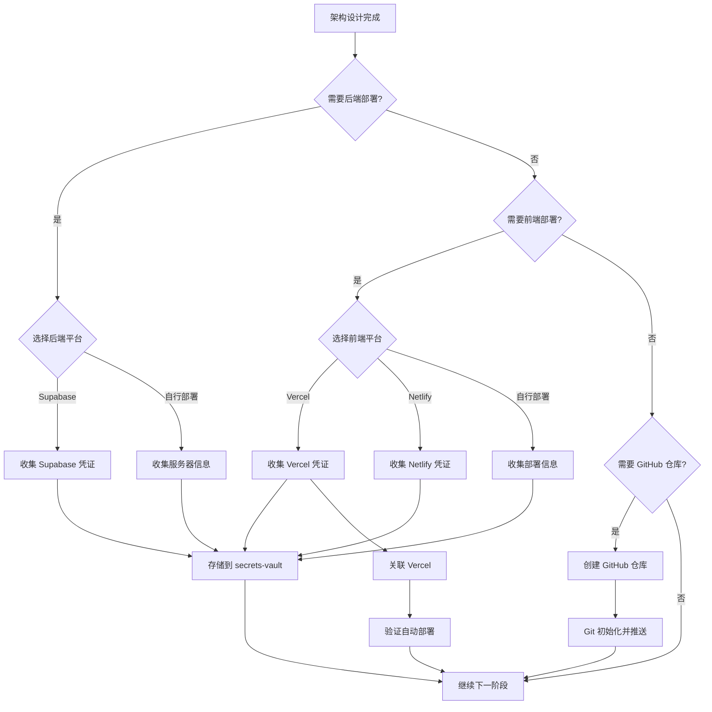

# 部署平台选项

> 本文档定义了 spec-driven-development skill 支持的部署平台选项和询问流程。
> **所有敏感信息通过 secrets-vault 管理。**

## 部署询问时机

在 **阶段2（架构设计）** 完成后，询问用户部署需求：

```
架构设计已完成。关于部署，我有几个问题：

1. 是否需要部署后端服务？
2. 是否需要部署前端应用？
3. 是否需要创建 GitHub 仓库并配置自动部署？
```

根据用户回答，继续询问具体平台选项。

---

## 代码托管选项

### GitHub（推荐）

**适用场景**:
- 需要代码版本管理
- 需要 CI/CD 集成
- 需要 Vercel/Netlify 自动部署

**自动化脚本**:
- `scripts/deployment/create_github_repo.py` - 创建仓库
- `scripts/deployment/link_vercel_github.py` - 关联 Vercel

**凭证信息**: 见 `credentials-checklist.md` 中的 GitHub 部分

**参考文档**: [github-integration.md](./github-integration.md)

### GitLab / Bitbucket

**适用场景**:
- 团队已有 GitLab/Bitbucket 账户
- 需要内置 CI/CD

**注意**: 当前 skill 脚本仅支持 GitHub，其他平台需手动配置

---

## 后端部署选项

### 选项1: Supabase（推荐）

**适用场景**:
- 需要 PostgreSQL 数据库
- 需要身份认证（Auth）
- 需要实时订阅（Realtime）
- 需要 Storage（文件存储）
- 需要 Edge Functions

**优点**:
- 开箱即用的后端服务
- 免费层适合开发和小型项目
- 自带 Dashboard 管理界面
- 支持 Row Level Security（RLS）

**凭证信息**: 见 `credentials-checklist.md` 中的 Supabase 部分

### 选项2: 自行部署（VPS/云服务器）

**适用场景**:
- 需要完全控制服务器环境
- 有特殊依赖或配置需求
- 需要本地数据库或其他服务

**平台选项**:
- AWS EC2
- 阿里云 ECS
- 腾讯云 CVM
- DigitalOcean Droplet
- Vultr

**凭证信息**: 见 `credentials-checklist.md` 中的自行部署部分

### 选项3: 容器化部署（Docker/K8s）

**适用场景**:
- 微服务架构
- 需要高可用和自动扩缩容
- 团队有运维能力

**平台选项**:
- AWS ECS / EKS
- Google Cloud Run / GKE
- Azure Container Instances / AKS
- 阿里云 ACK

---

## 前端部署选项

### 选项1: Vercel（推荐 Next.js）

**适用场景**:
- Next.js 项目（首选）
- React 静态站点
- 需要自动 CI/CD
- 需要边缘函数（Edge Functions）

**优点**:
- 零配置部署
- 自动 HTTPS
- 全球 CDN
- 预览环境自动生成
- **支持 GitHub 自动部署**

**自动化集成**:
- 使用 `link_vercel_github.py` 关联 GitHub 仓库
- 推送代码后自动触发部署

**凭证信息**: 见 `credentials-checklist.md` 中的 Vercel 部分

### 选项2: Netlify

**适用场景**:
- 静态站点
- JAMstack 项目
- 需要 Netlify Functions

**优点**:
- 简单易用
- 表单处理
- Functions 支持

### 选项3: GitHub Pages

**适用场景**:
- 纯静态站点
- 文档站点
- 个人项目

### 选项4: 自行部署

**平台选项**:
- 云服务器 + Nginx
- Cloudflare Pages
- AWS CloudFront + S3

---

## GitHub + Vercel 自动部署流程

当用户选择 GitHub + Vercel 组合时，执行以下流程：

```
┌─────────────────────────────────────────────────────────────────┐
│                GitHub + Vercel 自动部署流程                      │
│                                                                 │
│  1. 检查 secrets-vault 凭证                                     │
│     └─> github.token, github.username                          │
│     └─> vercel.token, vercel.team_id                           │
│                                                                 │
│  2. 创建 GitHub 仓库                                             │
│     └─> scripts/deployment/create_github_repo.py               │
│                                                                 │
│  3. 初始化 Git 并推送                                            │
│     └─> git init → git add → git commit → git push             │
│                                                                 │
│  4. 关联 Vercel                                                  │
│     └─> scripts/deployment/link_vercel_github.py               │
│                                                                 │
│  5. 验证部署                                                     │
│     └─> scripts/deployment/verify_deployment.py                │
│                                                                 │
│  后续: git push → 自动触发 Vercel 部署                           │
│                                                                 │
└─────────────────────────────────────────────────────────────────┘
```

详细步骤参见 [github-integration.md](./github-integration.md)

---

## 询问流程



---

## 域名和 DNS

无论选择哪种部署方式，都需要询问域名信息：

```
关于域名：
1. 是否有自定义域名？
2. DNS 是否已配置？
3. 是否需要配置 SSL 证书？
```

**DNS 配置参考**:
- A 记录：指向服务器 IP
- CNAME 记录：指向云平台域名
- MX 记录：邮件服务（如需要）

---

## 部署脚本参考

| 脚本 | 用途 | 文件 |
|------|------|------|
| create_github_repo.py | 创建 GitHub 仓库 | `scripts/deployment/` |
| link_vercel_github.py | 关联 Vercel | `scripts/deployment/` |
| verify_deployment.py | 验证部署状态 | `scripts/deployment/` |

---

## 示例项目

完整示例参见 [examples/github-vercel-deployment.md](../../examples/github-vercel-deployment.md)
